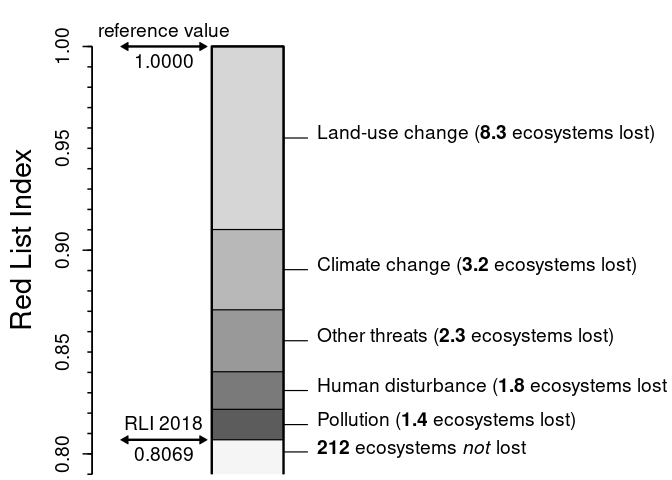
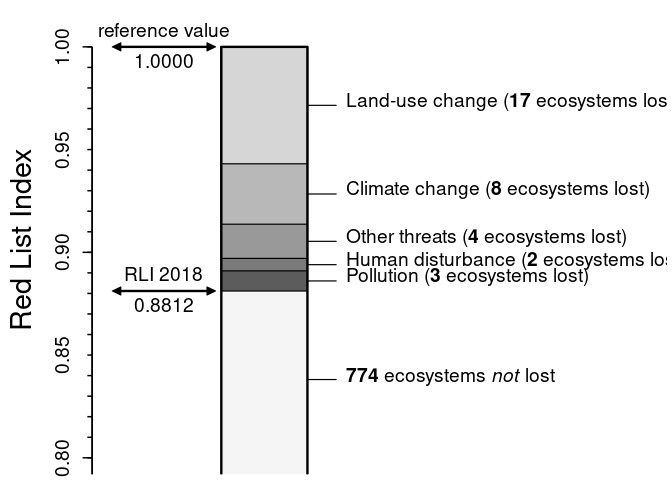

-   <a href="#variables" id="toc-variables">Variables</a>
-   <a href="#constants" id="toc-constants">Constants</a>
-   <a href="#preliminaries" id="toc-preliminaries">Preliminaries</a>
-   <a href="#read-and-check-the-data" id="toc-read-and-check-the-data">Read
    and check the data</a>
-   <a href="#prepare-the-data-frame-for-analyses"
    id="toc-prepare-the-data-frame-for-analyses">Prepare the data frame for
    analyses</a>
-   <a href="#summarise-the-data" id="toc-summarise-the-data">Summarise the
    data</a>
-   <a href="#analysis-of-threat-factors"
    id="toc-analysis-of-threat-factors">Analysis of threat factors</a>
-   <a href="#figure-4" id="toc-figure-4">Figure 4</a>
-   <a href="#disaggregation" id="toc-disaggregation">Disaggregation</a>
    -   <a href="#figure-s4" id="toc-figure-s4">Figure S4</a>

This **R** code can be used to run the analyses of the Norwegian Red
Lists for ecosystems and land-cover types described in the paper
“Metrics for quantifying how much different threats contribute to red
lists of species and ecosystems” ([Sandvik & Pedersen
2023](https://doi.org/10.1111/cobi.14105)).

## Variables

The following variables can be used to adjust the output.

**(1) Name of the data file.** The defaults downloads the Norwegian Red
List data for ecosystems from
[doi:10.5281/zenodo.7893216](https://doi.org/10.5281/zenodo.7893216). To
analyse other Red Lists, use `url = ""` and provide the file name of the
dataset as `file` (including file path, if needed).

    url  <- "https://zenodo.org/record/7893216/files/ecosyst.csv"
    file <- "ecosyst.csv"

**(2) Handling of DD species.** Decides whether Data Deficient
ecosystems are excluded (if FALSE) or randomly assigned to other Red
List categories (if TRUE).

    includeDD <- TRUE

**(3) Handling of unknown threats.** Decides whether (if TRUE) or not
(if FALSE) unknown threat factors should be inferred from the
distribution of the known threat factors.

    inferThreats <- FALSE

**(4) Disaggregation.** Decides whether ecosystem major types should be
disaggregated into their minor types.

    disaggregate <- FALSE

**(5) Weighting underlying RLI.** Defines the weighting scheme for the
Red List Index. (Defaults to “equal-steps”; other options are the IUCN
Red List Criteria “A1”, “A2”, “A3”, “B1”, “B2”, “C1”, “C2”, “C3”, “D1”,
“D2”, “D3” and “E” as well as “Ev2”, “Ev3”.)

    weightingRLI <- "equal-steps"

**(6) Weighting underlying ELS.** Defines the weighting scheme for the
Expected Loss of Systems. (Defaults to using the thresholds of the IUCN
Red List Criterion E; other options are “A1”, “A2”, “A3”, “B1”, “B2”,
“C1”, “C2”, “C3”, “D1”, “D2”, “D3”, “Ev2”, “Ev3” and “equal-steps”.)

    weightingELS <- "E"

**(7) Column names.** Column names in the dataset which contain Red List
Categories, threat factors, reasons for category change, and generation
time, respectively. The three former ones need to be followed by the
year of assessment (for change, the year of the *second* of the two
relevant assessments). So if the column name containing Red List
Categories is *not* named something like “Categ18” or “Categ2018”, this
needs to be adjusted here!

    Categ  <- "Categ"
    Threat <- "Threat"
    Change <- "Change"
    GTime  <- "GenTime"

Note the following formatting requirements of these columns:

-   Data columns with Red List Categories must match with the constants
    specified (see next section).
-   Threat columns must contain text strings specifying threat. Each
    threat must be described as a sequence of (abbreviations for) (i)
    threat factor, (ii) timing, (iii) scope and (iv) severity, which are
    separated by *colons*; different threats to the same ecosystem are
    separated by *commas*.
-   Change columns are needed only if the dataset contains results from
    more than one Red List. It must contain no more than one reason for
    change in Red List Category per ecosystem.

**(8) Abbreviations used.** What are the abbreviations used for unknown
threats and for real status change? The four “unknowns” can occur in the
`Threat` column(s), see previous item. (Defaults to the abbreviations
used in the dataset analysed in the paper. May need to be adjusted for
other datasets.) The latter is only needed if Red List Categories are to
be “back-cast” to earlier Red List assessments. It must occur in the
`Change` column(s), see previous item.

    unknownThreat   <- "unknownf"
    unknownTiming   <- "unknownt"
    unknownScope    <- "unknownp"
    unknownSeverity <- "unknownd"
    realChange      <- "realchng"

**(9) Timings to include.** What is (are) the abbreviation(s) of the
timing categories that should be considered (defaults to “ongoing”).

    inclTiming <- "ongoingt"

If *all* threats are to be included, irrespective of timing, this would
need to be replaced (in terms of the abbreviations used in this dataset)
by
`inclTiming <- c("onlypast", "suspendd", "ongoing", "onlyfutu", "unknownt")`.

**(10) Number of simulations.** NB: the default takes a while. For
exploration purposes, `nsim <- 1000` will suffice.

    nsim <- 100000

**(11) Re-create published estimates?** Decides whether the estimation
of confidence intervals should be re-created exactly as published (if
TRUE) or be based on novel random numbers (if FALSE)

    re.create <- TRUE

**(12) File names of figures.** If you want to display the figures on
screen, keep the default. If you want to create PNG files, specify the
file names (including paths).

    fig4  <- ""
    figS4 <- ""

## Constants

Constants should not normally need to be changed. Changing them entails
modifying some underlying assumptions.

**(1) Red List Categories** and their weights, extinction probabilities
etc. This data frame needs to contain all Red List Categories used in
the Red List analysed of ecosystems that have been evaluated:

    RLcateg <- data.frame(
      name  = c(  "LC",   "NT",   "VU",   "EN",   "CR",   "CO"),
      LC    = c(  TRUE,  FALSE,  FALSE,  FALSE,  FALSE,  FALSE),
      EX    = c( FALSE,  FALSE,  FALSE,  FALSE,  FALSE,   TRUE),
      wt    = c(     0,      1,      2,      3,      4,      5),
      lowP  = c(  0.00,   0.05,   0.10,   0.20,   0.50,   1.00),
      uppP  = c(  0.00,   0.10,   0.20,   0.50,   1.00,   1.00),
      lowT  = c(   100,    100,    100,     50,     50,     50),
      uppT  = c(   100,    100,     50,     50,     50,     50),
      lowG  = c(     0,      0,      0,      0,      0,      0),
      uppG  = c(     0,      0,      0,      0,      0,      0),
      lowA1 = c(  0.00,   0.20,   0.30,   0.50,   0.80,   1.00),
      uppA1 = c(  0.00,   0.30,   0.50,   0.80,   1.00,   1.00),
      lowA2 = c(  0.00,   0.20,   0.30,   0.50,   0.80,   1.00),
      uppA2 = c(  0.00,   0.30,   0.50,   0.80,   1.00,   1.00),
      lowB1 = c( 55000,  55000,  50000,  20000,   2000,      0),
      uppB1 = c( 55000,  50000,  20000,   2000,      0,      0),
      lowB2 = c(  5500,   5500,   5000,   2000,    200,      0),
      uppB2 = c(  5500,   5000,   2000,    200,      0,      0),
      lowC  = c(  0.00,   0.15,   0.24,   0.40,   0.64,   1.00),
      uppC  = c(  0.00,   0.24,   0.40,   0.64,   1.00,   1.00),
      lowD  = c(  0.00,   0.15,   0.24,   0.40,   0.64,   1.00),
      uppD  = c(  0.00,   0.24,   0.40,   0.64,   1.00,   1.00),
      distr = c("unif", "unif", "unif", "unif", "decr", "unif"),
      beta  = c(    NA,     NA,     NA,     NA,     NA,     NA),
      stringsAsFactors = FALSE
    )

The values in the dataframe are based on [IUCN
(2016)](https://doi.org/10.2305/IUCN.CH.2016.RLE.2.en), [Bland et
al. (2017)](https://doi.org/10.2305/IUCN.CH.2016.RLE.3.en) and the
Norwegian guidance document ([Artsdatabanken
2018](https://artsdatabanken.no/Files/27210/)). The columns have the
following meanings:

-   The column “LC” identifies the Red List Category “Least Concern”
    (defaults to IUCN’s abbreviation).
-   The column “EX” identified the Red List Categories for ecosystem
    collapse (defaults to IUCN’s abbreviations).
-   The column “wt” provides the Red List Weight of the Category
    (defaults to equal-steps weighting).
-   The columns “lowP” and “uppP” provide the lower and upper threshold
    values for extinction probability according to IUCN Red List
    Criterion E.
-   The columns “lowT” and “uppT” provide the lower and upper threshold
    values for extinction time frames in *years* according to IUCN Red
    List Criterion E.
-   The columns “lowG” and “uppG” are not used for ecosystems but should
    contain zeros.
-   The columns “lowA1” and “uppA1” provide the lower and upper
    threshold values for reduction in geographic distribution according
    to IUCN Red List Criterion A1.
-   The columns “lowA2” and “uppA2” provide the lower and upper
    threshold values for reduction in geographic distribution to IUCN
    Red List Criterion A2. (Note that A3 is not implemented.)
-   The columns “lowB1” and “uppB1” provide the lower and upper
    threshold values for extents of occurrence (EOO) according to IUCN
    Red List Criterion B1.
-   The columns “lowB2” and “uppB2” provide the lower and upper
    threshold values for areas of occupancy (AOO) according to IUCN Red
    List Criterion B2.
-   The columns “lowC” and “uppC” provide the lower and upper threshold
    values for environmental degradation according to IUCN Red List
    Criteria C1 and C2 (estimated as the *product* of *extent* and
    *relative severity* over a 50-year period; note that C3 is not
    implemented).
-   The columns “lowD” and “uppD” provide the lower and upper threshold
    values for disruption of biotic processes or interactions according
    to IUCN Red List Criteria D1 and D2 (estimated as the *product* of
    *extent* and *relative severity* over a 50-year period; note that D3
    is not implemented).
-   The column “distr” provides the distribution of extinction
    probabilities within the interval.
-   The column “beta” is not currently needed (but may be needed if
    “distr” is changed).

**(2) Data deficiency**. What is the abbreviation used for the “Data
Deficient” Red List Category? (Defaults to IUCN’s abbreviation.)

    DD <- "DD"

**(3) Not Evaluated.** Which Red List Categories exist for ecosystems
that have *not* been evaluated? (Defaults to IUCN’s abbreviations for
the Red List Categories “Not Applicable” and “Not Evaluated”.)

    notEval <- c("NA", "NE")

**(4) Downlisting.** What is added to a Red List Category to indicate
downlisting? (Defaults to the degree symbol.) If a Red List Category if
followed by this symbol, it is assumed to have been *downlisted* by
*one* Red List Category.

    downlistSymbol <- "°"

**(5) Severities** and their threshold values. This data frame needs to
contain all severity categories of threats used in the Red List
analysed:

    Severity <- data.frame(
      name  = c("negldecl", "slowdecl", "rapidecl", "unknownd"),
      lower = c(      0.00,       0.02,       0.20,       0.00),
      upper = c(      0.02,       0.20,       1.00,       1.00),
      distr = c(    "incr",     "unif",     "decr",     "beta"),
      beta  = c(        NA,         NA,         NA,         20),
      stringsAsFactors = FALSE
    )

The data frame defaults to the severity categories used in Norwegian Red
Lists, where values correspond to the declines in area of occupancy over
50 years caused by a threat ([Artsdatabanken
2018](https://artsdatabanken.no/Files/27210/); cf.  [IUCN
2022](https://www.iucnredlist.org/resources/threat-classification-scheme)).
The columns have the following meanings:

-   The column “name” contains the abbreviations used for the severity
    categories.
-   The column “lower” contains the lower limit of the respective
    interval.
-   The column “upper” contains the upper limit of the respective
    interval.
-   The column “distr” contains the distribution of values within the
    respective interval (possible values: “unif”, “incr”, “decr”,
    “beta”).
-   The column “beta” contains the beta parameter of a Beta distribution
    (a numeric values if `distr == "beta"`, and `NA` otherwise).

**(6) Time frame** for the Expected Loss of Systems, in years (defaults
to 50 years).

    TimeFrame <- 50

## Preliminaries

Load the set of functions belonging to this depository:

    eval(parse(text = readLines("function.R")))

Define further required variables, based on the variables and constants
specified above:

    LC      <- RLcateg$name[RLcateg$LC]  # abbreviation(s) for systems of Least Concern
    extinct <- RLcateg$name[RLcateg$EX]  # abbreviation(s) for collapsed systems
    LC.EX   <- RLcateg$name              # Red List Categories of evaluated systems
    RedListCat <- c(LC.EX, DD, notEval)  # all Red List Categories

## Read and check the data

Read the dataset “Norwegian Red List for ecosystems and land-cover
types”:

    {
      foundFile <- FALSE
      if (file.exists(file)) {
        foundFile <- TRUE
      } else {
        if (nchar(url)) {
          downl <- try(download.file(url, file))
          foundFile <- !inherits(downl, "try-error")
        }
      }
      if (foundFile) {
        RL <- read.csv2(file, as.is=TRUE, dec=".", na.strings="n/a", encoding="latin1")
      } else {
        cat("The datafile was not found.\n")
      }
    }

Check whether the data are as expected:

    {
      usedCategories <- checkRL(RL)
      years <- identifyYears(RL)
      cat("\nYears included in this dataset:\n")
      print(years)
      threats <- identifyThreats(RL)
      cat("\nThreat factors reported in this dataset:\n")
      print(threats)
    }

    ## Red List Categories are OK.
    ## WARNING: The threat factor "unknownf" does not occur in the dataset!
    ## WARNING: The dataset lacks a column containing generation times!
    ## 
    ## One or more problem(s) were found that may preclude further analyses!
    ## 
    ## Years included in this dataset:
    ## [1] 18
    ## 
    ## Threat factors reported in this dataset:
    ##  [1] "alienspe" "climatec" "disturba" "huntgath" "landusec" "natcatas" "nativesp" "otherthr" "pollutio" "unknownf"

We can ignore these two warnings in this case.

Ensure that `RedListCat` and `LC.EX` only contain categories that are
actually used:

    RedListCat <- RedListCat %A% usedCategories
    LC.EX      <-      LC.EX %A% usedCategories

## Prepare the data frame for analyses

**(1) Reverse downlisting**:

    RL <- uplist(RL) 

We wouldn’t have needed this step, since the dataset does not contain
downlisted Red List Categories.

**(2) Back-cast** knowledge from the most recent Red List to earlier
ones:

    RL <- backCast(RL)

    ## NB: There was no earlier Red List to back-cast to!

That’s correct, so we wouldn’t have needed this step either.

**(3) Calculate extinction probabilites** for all species:

    RL <- calcLoss(RL)

    ## WARNING: All generation times were assumed to be < 1 year.

This warning does not have to bother us when we are analysing Red Lists
of ecosystems.

**(4) Add columns for all threat factors**:

    RL <- addThreats(RL)

## Summarise the data

Summarise the Red List:

    tab <- summariseRL(RL, exclude = NULL)

    ##        N  LC NT VU EN CR DD NE       RLI Cum.ELS50
    ## RL18 229 103 34 40 22  4  7 19 0.8068966    16.957

## Analysis of threat factors

Estimate ΔRLI:

    DRLI <- DeltaRLI(RL)

    ## DeltaRLI can only be estimated if there are at least two Red Lists.

    print(DRLI)

    ## [1] NA

Estimate δRLI and ELS\_50\_:

    drli <- dRLI(RL)
    print(drli)

    ## $dRLI
    ##                  RL18
    ## alienspe 8.252927e-03
    ## climatec 3.939611e-02
    ## disturba 1.848226e-02
    ## huntgath 1.752848e-05
    ## landusec 8.987071e-02
    ## natcatas 2.100840e-04
    ## nativesp 6.039532e-03
    ## otherthr 8.359117e-03
    ## pollutio 1.495465e-02
    ## unknownf 7.520525e-03
    ## 
    ## $ELS50
    ##                  RL18
    ## alienspe 0.7271902493
    ## climatec 3.2254923250
    ## disturba 1.8227486794
    ## huntgath 0.0006441718
    ## landusec 8.2794577213
    ## natcatas 0.0137867647
    ## nativesp 0.5274527941
    ## otherthr 0.5385235062
    ## pollutio 1.3487037882
    ## unknownf 0.4730000000

Confidence intervals on RLI (loaded from a cached version of this call):

    print(confidenceRLI(RL, nsim, "Categ18"))

    ##      2.5%       25%       50%       75%     97.5% 
    ## 0.8009524 0.8047619 0.8066667 0.8085714 0.8123810

Confidence intervals on ΔRLI, δRLI and ELS\_50\_:

    results <- simulateDRLI(RL, nsim)

    ## 
    ## 
    ## Confidence intervals for the cumulative dRLI in 18:
    ##      2.5%       25%       50%       75%     97.5% 
    ## 0.1876190 0.1914286 0.1933333 0.1952381 0.1990476 
    ## 
    ## 
    ## Confidence intervals for the threat-wise dRLIs in 18:
    ##          alienspe   climatec   disturba     huntgath   landusec     natcatas    nativesp    otherthr   pollutio    unknownf
    ## 2.5%  0.006758343 0.03656412 0.01675931 6.795494e-06 0.08584420 7.156479e-05 0.005126745 0.006181287 0.01228131 0.004761905
    ## 25%   0.007687161 0.03829361 0.01794484 1.435925e-05 0.08836223 1.575950e-04 0.005738308 0.007383997 0.01391030 0.005714286
    ## 50%   0.008198793 0.03922720 0.01857568 1.809884e-05 0.08982168 2.262735e-04 0.006108323 0.008218062 0.01481735 0.007619048
    ## 75%   0.008730884 0.04017614 0.01921618 2.160334e-05 0.09136730 3.189405e-04 0.006474419 0.009310056 0.01576807 0.008571429
    ## 97.5% 0.009767632 0.04203056 0.02042585 2.976382e-05 0.09443842 5.457735e-04 0.007113675 0.011246090 0.01767791 0.011428571
    ## 
    ## 
    ## Confidence intervals for the cumulative ELS50 in 18:
    ##     2.5%      25%      50%      75%    97.5% 
    ## 15.75697 16.51144 16.93482 17.37599 18.27161 
    ## 
    ## 
    ## Confidence intervals for the threat-wise ELS50 in 18:
    ##        alienspe climatec disturba     huntgath landusec    natcatas  nativesp  otherthr pollutio  unknownf
    ## 2.5%  0.5151928 2.739900 1.507216 0.0002192553 7.465525 0.003455028 0.3568235 0.3180646 1.031892 0.1805618
    ## 25%   0.6450533 3.040555 1.707238 0.0004650567 7.985247 0.008799774 0.4549667 0.4310763 1.219050 0.2890853
    ## 50%   0.7202112 3.207417 1.824467 0.0006317647 8.270442 0.013913733 0.5306041 0.5092614 1.329281 0.4019564
    ## 75%   0.7972969 3.377408 1.946892 0.0008328888 8.565619 0.021298477 0.6052429 0.6120342 1.449206 0.6085508
    ## 97.5% 0.9576001 3.713596 2.192874 0.0012638595 9.177311 0.042441397 0.7098457 0.9837090 1.727132 1.0811737

## Figure 4

The following script recreates Figure 4.

Simplify the data by collapsing minor threats:

    drli. <- drli$dRLI[, 1]
    ELS.  <- drli$ELS50[,1]
    drli.["otherthr"] <- sum(drli.[c("alienspe", "huntgath", "natcatas",
                                     "nativesp", "otherthr", "unknownf")])
    ELS. ["otherthr"] <- sum(ELS. [c("alienspe", "huntgath", "natcatas",
                                     "nativesp", "otherthr", "unknownf")])
    drli. <-     drli.[-which(names(drli.) %in% c("alienspe", "huntgath", "natcatas",
                                                  "nativesp", "unknownf"))]
    ELS.  <-     ELS. [-which(names(ELS.)  %in% c("alienspe", "huntgath", "natcatas",
                                                  "nativesp", "unknownf"))]
    ELS.  <- ELS.[order(drli., decreasing=T)]
    drli. <- drli.[order(drli., decreasing=T)]

Plot a graph for δRLI:

    {
      xl <- c(6, 30)
      yl <- c(0.79, 1.02)
      if (nchar(fig4)) {
        png(fig4, 1500, 1200, res=180)
        xl <- c(7, 24)
        yl <- c(0.795, 1.01)
      }
      par(mai=c(0.06, 0.96, 0.06, 0.06), family="sans")
      plot(0, 0, xlim=xl, ylim=yl, xaxs="i", yaxs="i", xaxt="n", yaxt="n",
           xlab="", ylab="Red List Index", bty="n", cex.axis=1.2, cex.lab=1.8)
      axis(2, seq(0.7, 1, 0.1), F, T, lwd=1.5, lend=1)
      axis(2, seq(0.7, 1, 0.05), T, F, cex.axis=1.2, lwd=1.5, lend=1)
      axis(2, seq(0.7, 1, 0.01), F, T, tcl=-0.25, lwd=1.5, lend=1)
      rect(11, 0, 14, 1, col=grey(0.96))
      for (i in 5:1) {
        rect(11, 1 - sum(drli.[i:1]), 14, 1, lwd=1.2, col=grey(0.96 - i * 0.12))
      }
      rect(11, 0, 14, 1, lwd=2.4, col=NA)
      x1 <- 7.4; x2 <- 10.6
      rli <- RLI(RL$Categ18)
      lines(c(x1, x2), rep(rli, 2), lwd=2.4)
      lines(c(x1, x2), rep(1, 2), lwd=2.4)
      polygon(x1 + c(-0.2,  0.1,  0.1), rli + c(0, 0.002, -0.002), col="black")
      polygon(x2 + c( 0.2, -0.1, -0.1), rli + c(0, 0.002, -0.002), col="black")
      polygon(x1 + c(-0.2,  0.1,  0.1),  1  + c(0, 0.002, -0.002), col="black")
      polygon(x2 + c( 0.2, -0.1, -0.1),  1  + c(0, 0.002, -0.002), col="black")
      text(mean(c(x1, x2)), 1, "reference value", pos=3, cex=1.2)
      text(mean(c(x1, x2)), 1, "1.0000", pos=1, cex=1.2)
      text(mean(c(x1, x2)), rli, "RLI 2018", pos=3, cex=1.2)
      text(mean(c(x1, x2)), rli, "0.8069", pos=1, cex=1.2)
      text(15, 1 - 0.5 * sum(        0) - 0.5 * sum(drli.[1:1]),
           expression(paste("Land-use change (", bold("8.3"), " ecosystems lost)")), 
           pos=4, cex=1.2)
      text(15, 1 - 0.5 * sum(drli.[1:1]) - 0.5 * sum(drli.[1:2]),
           expression(paste("Climate change (", bold("3.2"), " ecosystems lost)")), 
           pos=4, cex=1.2)
      text(15, 1 - 0.5 * sum(drli.[1:2]) - 0.5 * sum(drli.[1:3]),
           expression(paste("Other threats (", bold("2.3"), " ecosystems lost)")), 
           pos=4, cex=1.2)
      text(15, 1 - 0.5 * sum(drli.[1:3]) - 0.5 * sum(drli.[1:4]),
           expression(paste("Human disturbance (", bold("1.8"), " ecosystems lost)")), 
           pos=4, cex=1.2)
      text(15, 1 - 0.5 * sum(drli.[1:4]) - 0.5 * sum(drli.[1:5]),
           expression(paste("Pollution (", bold("1.4"), " ecosystems lost)")), 
           pos=4, cex=1.2)
      text(15, 1 - 0.5 * sum(drli.[1:5]) - 0.5 * 0.205,
           expression(paste(bold("212"), " ecosystems ", italic("not"), " lost")), 
           pos=4, cex=1.2)
      lines(14:15, rep(1 - 0.5 * sum(         0) - 0.5 * sum(drli.[1:1]), 2), lwd=1.2)
      lines(14:15, rep(1 - 0.5 * sum(drli.[1:1]) - 0.5 * sum(drli.[1:2]), 2), lwd=1.2)
      lines(14:15, rep(1 - 0.5 * sum(drli.[1:2]) - 0.5 * sum(drli.[1:3]), 2), lwd=1.2)
      lines(14:15, rep(1 - 0.5 * sum(drli.[1:3]) - 0.5 * sum(drli.[1:4]), 2), lwd=1.2)
      lines(14:15, rep(1 - 0.5 * sum(drli.[1:4]) - 0.5 * sum(drli.[1:5]), 2), lwd=1.2)
      lines(14:15, rep(1 - 0.5 * sum(drli.[1:5]) - 0.5 * sum(     0.205), 2), lwd=1.2)
      if (nchar(fig4)) {
        dev.off()
      }
    }

## Disaggregation

The ecosystems assessed for the Norwegian Red List are at different
levels of the underlying [EcoSyst](https://doi.org/10.1111/geb.13164)
framework. The following analyses show the results obtained when major
ecosystem types are disaggregated into their subordinated minor
ecosystem types:

    {
      RL. <- disaggrMajorTypes(RL, minor = "MnTypes", type = "TypeCode", 
                               id = "FileID", categ = "Categ18.18")
      RL. <-    calcLoss(RL.)
      RL. <-  addThreats(RL.)
      cat("Summary table:\n")
      tab <- summariseRL(RL.)
      drli. <- dRLI(RL.)
      cat("\ndRLI after disaggregation into minor types:\n")
      print(drli.$dRLI)
      cat("\nELS50 after disaggregation into minor types:\n")
      print(drli.$ELS50)
    }

    ## Summary table:
    ##        N  LC NT  VU EN CR DD       RLI Cum.ELS50
    ## RL18 760 506 70 124 35  4 21 0.8811908    33.624
    ## 
    ## dRLI after disaggregation into minor types:
    ##                  RL18
    ## alienspe 7.208655e-03
    ## climatec 2.937604e-02
    ## disturba 6.048705e-03
    ## huntgath 6.780756e-05
    ## landusec 5.692505e-02
    ## natcatas 5.804954e-05
    ## nativesp 2.195134e-03
    ## otherthr 3.264632e-03
    ## pollutio 9.790767e-03
    ## unknownf 3.874368e-03
    ## 
    ## ELS50 after disaggregation into minor types:
    ##                  RL18
    ## alienspe  2.250704490
    ## climatec  7.570356533
    ## disturba  2.005463101
    ## huntgath  0.009018405
    ## landusec 16.585557519
    ## natcatas  0.013786765
    ## nativesp  0.652452794
    ## otherthr  0.751523506
    ## pollutio  2.913136887
    ## unknownf  0.872000000

### Figure S4

The following script recreates Figure S4.

Simplify the data by collapsing minor threats:

    ELS.  <- drli.$ELS50[,1]
    drli. <- drli.$dRLI[, 1]
    ELS. ["otherthr"] <- sum(ELS. [c("alienspe", "huntgath", "natcatas",
                                     "nativesp", "otherthr", "unknownf")])
    drli.["otherthr"] <- sum(drli.[c("alienspe", "huntgath", "natcatas",
                                     "nativesp", "otherthr", "unknownf")])
    ELS.  <-     ELS. [-which(names(ELS.)  %in% c("alienspe", "huntgath", "natcatas",
                                                  "nativesp", "unknownf"))]
    drli. <-     drli.[-which(names(drli.) %in% c("alienspe", "huntgath", "natcatas",
                                                  "nativesp", "unknownf"))]
    ELS.  <- ELS. [c(3, 1, 4, 2, 5)]
    drli. <- drli.[c(3, 1, 4, 2, 5)]

Plot a graph for δRLI:

    {
      xl <- c(6.5, 26.5)
      yl <- c(0.792, 1.02)
      if (nchar(figS4)) {
        png("c:\\art\\threats\\figS4.png", 1500, 1200, res=180)
        xl <- c(7, 24)
        yl <- c(0.795, 1.01)
      }
      par(mai=c(0.06, 0.96, 0.06, 0.06), family="sans")
      plot(0, 0, xlim=xl, ylim=yl, 
           xaxs="i", yaxs="i", xaxt="n", yaxt="n",
           xlab="", ylab="Red List Index", bty="n", cex.axis=1.2, cex.lab=1.8)
      axis(2, seq(0.7, 1, 0.10), F, T, lwd=1.5, lend=1)
      axis(2, seq(0.7, 1, 0.05), T, F, cex.axis=1.2, lwd=1.5, lend=1)
      axis(2, seq(0.7, 1, 0.01), F, T, tcl=-0.25, lwd=1.5, lend=1)
      rect(11, 0, 14, 1, col=grey(0.96))
      for (i in 5:1) {
        rect(11, 1 - sum(drli.[i:1]), 14, 1, lwd=1.2, col=grey(0.96 - i * 0.12))
      }
      rect(11, 0, 14, 1, lwd=2.4, col=NA)
      x1 <- 7.4; x2 <- 10.6
      rli <- RLI(RL.$Categ18.18)
      lines(c(x1, x2), rep(rli, 2), lwd=2.4)
      lines(c(x1, x2), rep(1, 2), lwd=2.4)
      polygon(x1 + c(-0.2,  0.1,  0.1), rli + c(0, 0.002, -0.002), col="black")
      polygon(x2 + c( 0.2, -0.1, -0.1), rli + c(0, 0.002, -0.002), col="black")
      polygon(x1 + c(-0.2,  0.1,  0.1),  1  + c(0, 0.002, -0.002), col="black")
      polygon(x2 + c( 0.2, -0.1, -0.1),  1  + c(0, 0.002, -0.002), col="black")
      text(mean(c(x1, x2)), 1, "reference value", pos=3, cex=1.2)
      text(mean(c(x1, x2)), 1, "1.0000", pos=1, cex=1.2)
      text(mean(c(x1, x2)), rli, "RLI 2018", pos=3, cex=1.2)
      text(mean(c(x1, x2)), rli, "0.8812", pos=1, cex=1.2)
      text(15, 1 - 0.5 * sum(         0) - 0.5 * sum(drli.[1:1]),
           expression(paste("Land-use change (", bold("17"), " ecosystems lost)")),
           pos=4, cex=1.2)
      text(15, 1 - 0.5 * sum(drli.[1:1]) - 0.5 * sum(drli.[1:2]),
           expression(paste("Climate change (", bold("8"), " ecosystems lost)")), 
           pos=4, cex=1.2)
      text(15, 1 - 0.5 * sum(drli.[1:2]) - 0.5 * sum(drli.[1:3]),
           expression(paste("Other threats (", bold("4"), " ecosystems lost)")), 
           pos=4, cex=1.2)
      text(15, 1 - 0.5 * sum(drli.[1:3]) - 0.5 * sum(drli.[1:4]),
           expression(paste("Human disturbance (", bold("2"), " ecosystems lost)")), 
           pos=4, cex=1.2)
      text(15, 1 - 0.5 * sum(drli.[1:4]) - 0.5 * sum(drli.[1:5]),
           expression(paste("Pollution (", bold("3"), " ecosystems lost)")), 
           pos=4, cex=1.2)
      text(15, 1 - 0.5 * sum(drli.[1:5]) - 0.5 * 0.205,
           expression(paste(bold("774"), " ecosystems ", italic("not"), " lost")), 
           pos=4, cex=1.2)
      lines(14:15, rep(1 - 0.5 * sum(         0) - 0.5 * sum(drli.[1:1]), 2), lwd=1.2)
      lines(14:15, rep(1 - 0.5 * sum(drli.[1:1]) - 0.5 * sum(drli.[1:2]), 2), lwd=1.2)
      lines(14:15, rep(1 - 0.5 * sum(drli.[1:2]) - 0.5 * sum(drli.[1:3]), 2), lwd=1.2)
      lines(14:15, rep(1 - 0.5 * sum(drli.[1:3]) - 0.5 * sum(drli.[1:4]), 2), lwd=1.2)
      lines(14:15, rep(1 - 0.5 * sum(drli.[1:4]) - 0.5 * sum(drli.[1:5]), 2), lwd=1.2)
      lines(14:15, rep(1 - 0.5 * sum(drli.[1:5]) - 0.5 * sum(     0.205), 2), lwd=1.2)
      if (nchar(figS4)) {
        dev.off()
      }
    }

