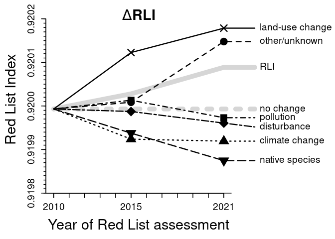
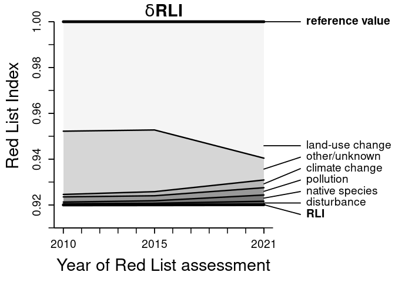
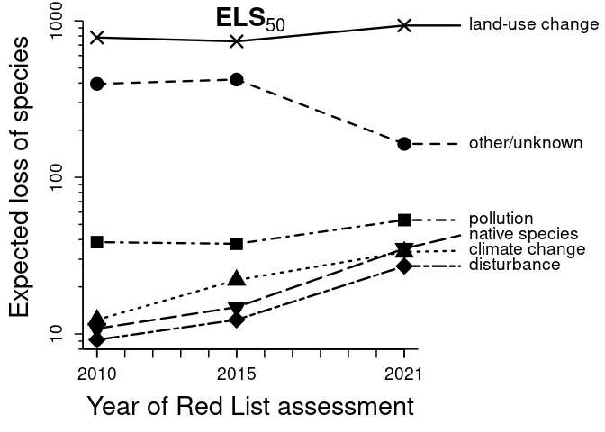
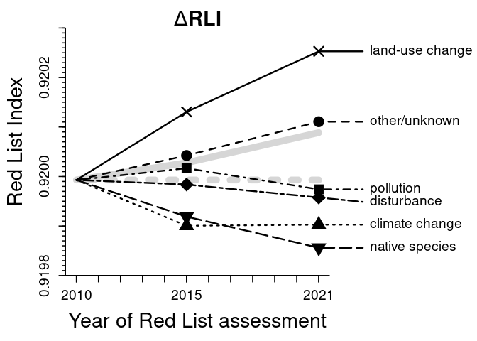
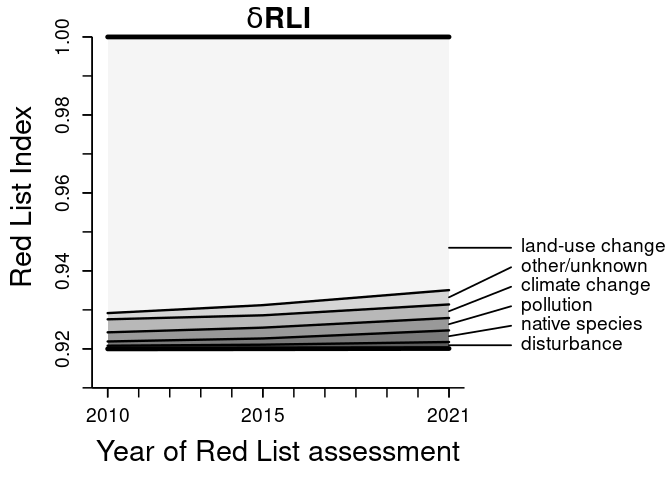
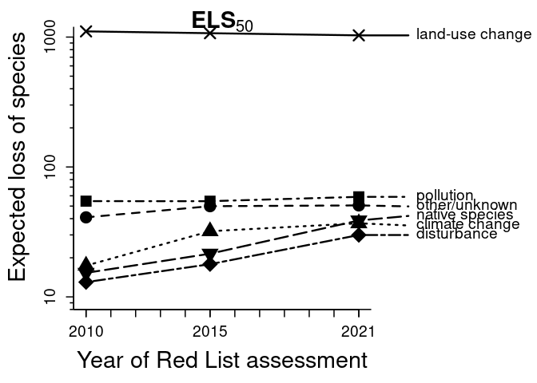

# Threats to species
## Quantification of threats on the Norwegian Red Lists of species

_Author and date:_ Hanno Sandvik, 24 May 2023

This **R** code can be used to run the analyses of the Norwegian Red
Lists for species described in the paper “Metrics for quantifying how
much different threats contribute to red lists of species and
ecosystems” ([Sandvik & Pedersen
2023](https://doi.org/10.1111/cobi.14105)).

_Contents:_

-   <a href="#variables" id="toc-variables">Variables</a>
-   <a href="#constants" id="toc-constants">Constants</a>
-   <a href="#preliminaries" id="toc-preliminaries">Preliminaries</a>
-   <a href="#read-and-check-the-data" id="toc-read-and-check-the-data">Read
    and check the data</a>
-   <a href="#prepare-the-data-frame-for-analyses"
    id="toc-prepare-the-data-frame-for-analyses">Prepare the data frame for
    analyses</a>
-   <a href="#summarise-the-data" id="toc-summarise-the-data">Summarise the
    data</a>
-   <a href="#analysis-of-threat-factors"
    id="toc-analysis-of-threat-factors">Analysis of threat factors</a>
-   <a href="#figures" id="toc-figures">Figures</a>
    -   <a href="#figure-1" id="toc-figure-1">Figure 1</a>
    -   <a href="#figure-2" id="toc-figure-2">Figure 2</a>
    -   <a href="#figure-3" id="toc-figure-3">Figure 3</a>
-   <a href="#analysis-with-dd-species-excluded"
    id="toc-analysis-with-dd-species-excluded">Analysis with DD species
    excluded</a>
-   <a href="#analysis-with-unknown-threats-inferred"
    id="toc-analysis-with-unknown-threats-inferred">Analysis with unknown
    threats inferred</a>
    -   <a href="#appendix-s7" id="toc-appendix-s7">Appendix S7</a>
    -   <a href="#appendix-s8" id="toc-appendix-s8">Appendix S8</a>
    -   <a href="#appendix-s9" id="toc-appendix-s9">Appendix S9</a>
-   <a href="#sensitivity-analysis"
    id="toc-sensitivity-analysis">Sensitivity analysis</a>

## Variables

The following variables can be used to adjust the output.

**(1) Name of the data file.** The default downloads the Norwegian Red
List data for species from
[doi:10.5281/zenodo.7893216](https://doi.org/10.5281/zenodo.7893216). To
analyse other Red Lists, use `url = ""` and provide the file name of the
dataset as `file` (including file path, if needed).

    url  <- "https://zenodo.org/record/7893216/files/species.csv"
    file <- "species.csv"

**(2) Handling of DD species.** Decides whether Data Deficient species
are excluded (if FALSE) or randomly assigned to other Red List
Categories (if TRUE).

    includeDD <- TRUE

**(3) Handling of unknown threats.** Decides whether (if TRUE) or not
(if FALSE) unknown threat factors should be inferred from the
distribution of the known threat factors.

    inferThreats <- FALSE

**(4) Weighting schemes.** Defines the weighting scheme for the Red List
Index and the Expected Loss of Species. (Defaults to “equal-steps” for
RLI and the thresholds of the IUCN Red List Criterion E for ELS; other
options are the IUCN Red List Criteria “A1”, “A2”, “B1”, “B2”, “C” and
“D” as well as “Ev2”, “Ev3”.)

    weightingRLI <- "equal-steps"
    weightingELS <- "E"

**(5) Column names.** Column names in the dataset which contain Red List
Categories, threat factors, reasons for category change, and generation
time, respectively. The three former ones need to be followed by the
year of assessment (for change, the year of the *second* of the two
relevant assessments). So if the column name containing Red List
Categories is *not* named something like “Categ21” or “Categ2021”, this
needs to be adjusted here!

    Categ  <- "Categ"
    Threat <- "Threat"
    Change <- "Change"
    GTime  <- "GenTime"

Note the following formatting requirements of these columns:

-   Red List Categories in the “Categ” column must match with the
    constants specified (see next section).
-   Threat columns must contain text strings specifying threats. Each
    threat must be described as a sequence of (abbreviations for) (i)
    threat factor, (ii) timing, (iii) scope and (iv) severity, which are
    separated by *colons*; different threats to the same species are
    separated by *commas*.
-   Change columns are needed only if the dataset contains results from
    more than one Red List. It must contain no more than one reason for
    change in Red List Category per species.
-   Generation time, measured in *years*, must be a numerical variable.

**(6) Abbreviations used for threats.** What are the abbreviations used
for unknown threats? They can occur in the `Threat` column(s), see
previous item. (Defaults to the abbreviations used in the dataset
analysed in the paper. May need to be adjusted for other datasets.)

    unknownThreat   <- "unknownf"
    unknownTiming   <- "unknownt"
    unknownScope    <- "unknownp"
    unknownSeverity <- "unknownd"

**(7) Abbreviation used for real change.** What is the abbreviations
used for real population changes? This is only needed if Red List
Categories are to be “back-cast” to earlier Red List assessments. It
must occur in the `Change` column(s), see item (5). (Defaults to the
abbreviation used in the dataset analysed in the paper. May need to be
adjusted for other datasets.)

    realChange <- "realpopu"

**(8) Timings to include.** What is (are) the abbreviation(s) of the
timing categories that should be considered (defaults to “ongoing”).

    inclTiming <- "ongoingt"

If *all* threats are to be included, irrespective of timing, this would
need to be replaced (in terms of the abbreviations used in this dataset)
by
`inclTiming <- c("onlypast", "suspendd", "ongoing", "onlyfutu", "unknownt")`.

**(9) Calculation of threat scores.** Decides whether threat scores are
based on the product of scope and severity (if TRUE) or on severity
alone (if FALSE).

    useIUCNthreats <- FALSE

IUCN now
[states](https://www.iucnredlist.org/resources/threat-classification-scheme)
that severities should describe the population decline *within the
scope* of a particular threat. If this definition has been followed,
`useIUCNthreats` should be `TRUE`. Previously, however, the definition
of severity was ambiguous. In the Norwegian Red Lists analysed here,
severity was used to describe the decline of the *entire population*.
The default value (FALSE) assumes the latter situation, in which
severity should *not* be multiplied with scope. (See [here](scopesev.md)
for some more detail.)

**(10) Number of simulations.** NB: the default takes several hours! For
exploration purposes, `nsim <- 1000` will suffice. For pure
illustration, `nsim <- 100` is enough.

    nsim <- 100000

**(11) Re-create published estimates?** Decides whether the estimation
of confidence intervals should be re-created exactly as published (if
TRUE) or be based on novel random numbers (if FALSE).

    re.create <- TRUE

**(12) File names of figures.** If you want to display the figures on
screen, keep the default. If you want to create PNG files, specify the
file names (including paths).

    fig1  <- ""
    fig2  <- ""
    fig3  <- ""
    figS1 <- ""
    figS2 <- ""
    figS3 <- ""

## Constants

Constants should not normally need to be changed. Changing them entails
modifying some underlying assumptions.

**(1) Red List Categories** and their weights, extinction probabilities
etc. This data frame needs to contain all Red List Categories used in
the Red List analysed of species that have been evaluated:

    RLcateg <- data.frame(
      name  = c(  "LC",   "NT",   "VU",   "EN",   "CR",   "RE",   "EW",   "EX"),
      LC    = c(  TRUE,  FALSE,  FALSE,  FALSE,  FALSE,  FALSE,  FALSE,  FALSE),
      EX    = c( FALSE,  FALSE,  FALSE,  FALSE,  FALSE,   TRUE,   TRUE,   TRUE),
      wt    = c(     0,      1,      2,      3,      4,      5,      5,      5),
      lowP  = c(  0.00,   0.05,   0.10,   0.20,   0.50,   1.00,   1.00,   1.00),
      uppP  = c(  0.00,   0.10,   0.20,   0.50,   1.00,   1.00,   1.00,   1.00),
      lowT  = c(   100,    100,    100,     20,     10,     10,     10,     10),
      uppT  = c(   100,    100,     20,     10,     10,     10,     10,     10),
      lowG  = c(     0,      0,      0,      5,      3,      1,      1,      1),
      uppG  = c(     0,      0,      5,      3,      1,      1,      1,      1),
      lowA1 = c(  0.00,   0.25,   0.50,   0.70,   0.90,   1.00,   1.00,   1.00),
      uppA1 = c(  0.00,   0.50,   0.70,   0.90,   1.00,   1.00,   1.00,   1.00),
      lowA2 = c(  0.00,   0.15,   0.30,   0.50,   0.80,   1.00,   1.00,   1.00),
      uppA2 = c(  0.00,   0.30,   0.50,   0.80,   1.00,   1.00,   1.00,   1.00),
      lowB1 = c( 40000,  40000,  20000,   5000,    100,      0,      0,      0),
      uppB1 = c( 40000,  20000,   5000,    100,      0,      0,      0,      0),
      lowB2 = c(  4000,   4000,   2000,    500,     10,      0,      0,      0),
      uppB2 = c(  4000,   2000,    500,     10,      0,      0,      0,      0),
      lowC  = c( 20000,  20000,  10000,   2500,    250,      0,      0,      0),
      uppC  = c( 20000,  10000,   2500,    250,      0,      0,      0,      0),
      lowD  = c(  2000,   2000,   1000,    250,     50,      0,      0,      0),
      uppD  = c(  2000,   1000,    250,     50,      0,      0,      0,      0),
      distr = c("unif", "unif", "unif", "unif", "decr", "unif", "unif", "unif"),
      beta  = c(    NA,     NA,     NA,     NA,     NA,     NA,     NA,     NA),
      stringsAsFactors = FALSE
    )

The values in the dataframe are based on [IUCN
(2012a)](https://portals.iucn.org/library/node/10315), [IUCN
(2012b)](https://portals.iucn.org/library/node/10336), [IUCN
(2022)](https://www.iucnredlist.org/resources/redlistguidelines) and the
Norwegian guidance document ([Artsdatabanken
2020](https://artsdatabanken.no/Files/41216/)). The columns have the
following meanings:

-   The column “LC” identifies the Red List Category “Least Concern”
    (defaults to IUCN’s abbreviation).
-   The column “EX” identified the Red List Categories for extinction
    (defaults to IUCN’s abbreviations).
-   The column “wt” provides the Red List Weight of the Category
    (defaults to equal-steps weighting).
-   The columns “lowP” and “uppP” provide the lower and upper threshold
    values for extinction probability according to IUCN Red List
    Criterion E.
-   The columns “lowT” and “uppT” provide the lower and upper threshold
    values for extinction time frames in *years* according to IUCN Red
    List Criterion E.
-   The columns “lowG” and “uppG” provide the lower and upper threshold
    values for extinction time in *generations* according to IUCN Red
    List Criterion E.
-   The columns “lowA1” and “uppA1” provide the lower and upper
    threshold values for population reduction according to IUCN Red List
    Criterion A1.
-   The columns “lowA2” and “uppA2” provide the lower and upper
    threshold values for population reduction according to IUCN Red List
    Criterion A2.
-   The columns “lowB1” and “uppB1” provide the lower and upper
    threshold values for extents of occurrence (EOO) according to IUCN
    Red List Criterion B1.
-   The columns “lowB2” and “uppB2” provide the lower and upper
    threshold values for areas of occupancy (AOO) according to IUCN Red
    List Criterion B2.
-   The columns “lowC” and “uppC” provide the lower and upper threshold
    values for population size according to IUCN Red List Criterion C.
-   The columns “lowD” and “uppD” provide the lower and upper threshold
    values for population size according to IUCN Red List Criterion D.
-   The column “distr” provides the distribution of extinction
    probabilities within the interval.
-   The column “beta” is not currently needed (but may be needed if
    “distr” is changed).

**(2) Special Red List Categories.** What are the abbreviations used for
data-deficient species and for species that have *not* been evaluated?
(Defaults to IUCN’s abbreviations.)

    DD <- "DD"
    notEval <- c("NA", "NE")

**(3) Downlisting.** What is added to a Red List Category to indicate
downlisting? (Defaults to the degree symbol.) If a Red List Category is
followed by this symbol, it is assumed to have been *downlisted* by
*one* Red List Category.

    downlistSymbol <- "\u00b0"  # degree symbol in unicode
    downlistSymbol <- iconv(downlistSymbol, Encoding(downlistSymbol), "latin1")

**(4) Scopes** and their threshold values. This data frame needs to
contain all scope classes of threats used in the Red List analysed. Two
versions of the data frames are provided, one for analysis of the
Norwegian Red List data (the default) and one with the scope classes
defined by IUCN
([2023](https://www.iucnredlist.org/resources/threat-classification-scheme)):

    ScopeNorway <- data.frame(
      name  = c("neglprop", "minority", "majority", "wholepop", "unknownp"),
      lower = c(      0.00,       0.05,       0.50,       0.90,       0.00),
      upper = c(      0.05,       0.50,       0.90,       1.00,       1.00),
      distr = c(    "unif",     "unif",     "unif",     "unif",     "beta"),
      beta  = c(        NA,         NA,         NA,         NA,          2),
      stringsAsFactors = FALSE
    )

    ScopeIUCN <- data.frame(
      name  = c("minority", "majority", "wholepop", "unknownp"),
      lower = c(      0.00,       0.50,       0.90,       0.00),
      upper = c(      0.50,       0.90,       1.00,       1.00),
      distr = c(    "unif",     "unif",     "unif",     "beta"),
      beta  = c(        NA,         NA,         NA,          2),
      stringsAsFactors = FALSE
    )

    if (useIUCNthreats) {
      Scope <- ScopeIUCN
    } else {
      Scope <- ScopeNorway
    }

Values are the proportions of the total population affected by a threat
([Artsdatabanken 2020](https://artsdatabanken.no/Files/41216/); cf. 
[IUCN
2023](https://www.iucnredlist.org/resources/threat-classification-scheme)).
The columns have the following meanings:

-   The column “name” contains the abbreviations used for the scope
    classes.
-   The column “lower” contains the lower limit of the respective
    interval.
-   The column “upper” contains the upper limit of the respective
    interval.
-   The column “distr” contains the distribution of values within the
    respective interval (possible values: “unif”, “incr”, “decr”,
    “beta”).
-   The column “beta” contains the beta parameter of a Beta distribution
    (a numeric values if `distr == "beta"`, and `NA` otherwise).

**(5) Severities** and their threshold values. This data frame needs to
contain all severity classes of threats used in the Red List analysed.
Two versions of the data frame are provided, one for analysis of the
Norwegian Red List data (the default) and one with the severity classes
defined by IUCN
([2023](https://www.iucnredlist.org/resources/threat-classification-scheme)):

    SeverityNorway <- data.frame(
      name  = c("negldecl", "slowdecl", "rapidecl", "unknownd"),
      lower = c(      0.00,       0.02,       0.20,       0.00),
      upper = c(      0.02,       0.20,       1.00,       1.00),
      distr = c(    "incr",     "unif",     "decr",     "beta"),
      beta  = c(        NA,         NA,         NA,         20),
      stringsAsFactors = FALSE
    )

    SeverityIUCN <- data.frame(
      name  = c("nodeclin", "negldecl", "slowdecl", "rapidecl", "veryrapd", "fluctuat", "unknownd"),
      lower = c(      0.00,       0.00,       0.02,       0.20,       0.30,       0.02,       0.00),
      upper = c(      0.00,       0.02,       0.20,       0.30,       1.00,       0.20,       1.00),
      distr = c(    "unif",     "unif",     "unif",     "unif",     "decr",     "unif",     "beta"),
      beta  = c(        NA,         NA,         NA,         NA,         NA,         NA,         20),
      stringsAsFactors = FALSE
    )

    if(useIUCNthreats) {
      Severity <- SeverityIUCN
    } else {
      Severity <- SeverityNorway
    }

Values correspond to the declines in population size over 10 years or 3
generations (whichever is largest) caused by a threat ([Artsdatabanken
2020](https://artsdatabanken.no/Files/41216/); cf.  [IUCN
2023](https://www.iucnredlist.org/resources/threat-classification-scheme)).
The columns have the following meanings:

-   The column “name” contains the abbreviations used for the severity
    classes.
-   The column “lower” contains the lower limit of the respective
    interval.
-   The column “upper” contains the upper limit of the respective
    interval.
-   The column “distr” contains the distribution of values within the
    respective interval (possible values: “unif”, “incr”, “decr”,
    “beta”; see [here](scopesev.md) for the rationale).
-   The column “beta” contains the beta parameter of a Beta distribution
    (a numeric values if `distr == "beta"`, and `NA` otherwise).

**(6) Time frame** for the Expected Loss of Species, in years (defaults
to 50 years).

    TimeFrame <- 50

## Preliminaries

Load the set of functions belonging to this repository:

    eval(parse(text = readLines("function.R")))

Define further required variables, based on the variables and constants
specified above:

    LC      <- RLcateg$name[RLcateg$LC]  # abbreviation(s) for species of Least Concern
    extinct <- RLcateg$name[RLcateg$EX]  # abbreviation(s) for extinct species
    LC.EX   <- RLcateg$name              # Red List Categories of evaluated species
    RedListCat <- c(LC.EX, DD, notEval)  # all Red List Categories

## Read and check the data

Read the dataset “Norwegian Red List for species”:

    {
      foundFile <- FALSE
      if (file.exists(file)) {
        foundFile <- TRUE
      } else {
        if (nchar(url)) {
          downl <- try(download.file(url, file))
          foundFile <- !inherits(downl, "try-error")
        }
      }
      if (foundFile) {
        RL <- read.csv2(file, as.is=TRUE, dec=".", na.strings="n/a", encoding="latin1")
      } else {
        cat("The datafile was not found.\n")
      }
    }

Check whether the data are as expected:

    {
      usedCategories <- checkRL(RL)
      years <- identifyYears(RL)
      cat("\nYears included in this dataset:\n")
      print(years)
      threats <- identifyThreats(RL)
      cat("\nThreat factors reported in this dataset:\n")
      print(threats)
    }

    ## Red List Categories are OK.
    ## Threat columns are OK.
    ## Change columns are OK.
    ## Generation time was found.
    ## 
    ## Everything looks fine so far!
    ## 
    ## Years included in this dataset:
    ## [1] 21 15 10
    ## 
    ## Threat factors reported in this dataset:
    ##  [1] "alienspe" "bycatchc" "climatec" "disturba" "huntgath" "landusec" "natcatas" "nativesp" "nothreat" "otherthr" "outsiden"
    ## [12] "pollutio" "unknownf"

Ensure that `RedListCat` and `LC.EX` only contain categories that are
actually used:

    RedListCat <- RedListCat %A% usedCategories
    LC.EX      <-      LC.EX %A% usedCategories

## Prepare the data frame for analyses

**(1) Reverse downlisting**:

    # Take a backup of the downlisted RL Categories in 2012
    RL$Cat21orig <- downlist(RL)$Categ21
    # Then reverse downlisting
    RL <- uplist(RL) 

This step is only needed if the dataset contains species that have been
downlisted due to rescue effects in other countries. Undoing this
downlisting is motivated by the wish to quantify threats that can be
addressed by management authorities in a given country.

If you want to analyse the data with downlisting retained, use instead
the command `RL <- downlist(RL)`.

**(2) Back-cast** knowledge from the most recent Red List to earlier
ones:

    RL <- backCast(RL)

This step is only needed if the dataset contains Red List Categories
from different Red List Assessments. It corrects earlier assessments for
the best available (i.e. most recent) information.

**(3) Calculate extinction probabilites** for all species:

    RL <- calcLoss(RL)

**(4) Add columns for all threat factors**:

    RL <- addThreats(RL)

## Summarise the data

Summarise the Red Lists:

    tab <- summariseRL(RL)

    ##             N    LC   NT   VU   EN  CR  RE  DD       RLI Cum.ELS50
    ## RL10    21267 16611 1294 1260  898 289 126 789 0.9189960  1185.416
    ## RL10.15 21160 16656 1256 1245  910 251 118 724 0.9210217  1126.659
    ## RL10.21 23744 18675 1395 1519 1001 299 114 741 0.9199930  1247.429
    ## RL15    21160 16665 1246 1252  903 252 118 724 0.9211490  1123.817
    ## RL15.21 23744 18682 1389 1517  999 302 114 741 0.9200278  1246.852
    ## RL21    23744 18683 1392 1514  997 305 112 741 0.9200887  1245.979

In the specific case of the three Norwegian Red Lists analysed, the
dataset only contains the species included in the current Red List
(2021). For different reasons (such as taxonomic change), the earlier
Red Lists contained species (names) that are not included in the most
recent one. Therefore, the above summary table is not entirely correct
for the earlier Red Lists. This has to be corrected manually by adding
data for the Red Lists 2010 and 2015 (prior to back-casting). The
sources for these data are:

-   [Artsdatabanken (2010)](http://www.artsportalen.artsdatabanken.no/)
-   [Artsdatabanken (2015)](https://www.artsdatabanken.no/Rodlista2015)

<!-- -->

    # Create a new table for the results:
    Table3 <- matrix(as.numeric(NA), 9, length(RedListCat) + 3, dimnames=list(
      "RL" %+% c("2010" %+% downlistSymbol, "2010", "2010(15)", "2010(21)",
                 "2015" %+% downlistSymbol, "2015", "2015(21)", 
                 "2021" %+% downlistSymbol, "2021"),
      c("N", RedListCat, "RLI", "Cum.ELS50")
    ))
    alphabetic <- sort(RedListCat)

    # Manually add the figures for the earlier Red Lists:
    Table3[1, match(alphabetic, colnames(Table3))] <-
      c(284, 809, 890, 16762, 2580, 6528, 1310, 127, 1265)
    Table3[2, match(alphabetic, colnames(Table3))] <-
      c(290, 809, 908, 16745,   NA,   NA, 1302, 127, 1266)
    Table3[5, match(alphabetic, colnames(Table3))] <-
      c(247, 755, 901, 17594, 3018, 6095, 1302, 119, 1294)
    Table3[6, match(alphabetic, colnames(Table3))] <- 
      c(252, 755, 916, 17579,   NA,   NA, 1297, 119, 1294)
    tb <- table(RL$Cat21orig)
    Table3[8, match(names(tb), colnames(Table3))] <- tb
    Loss21o <- LoS(RL$Cat21orig, RL$GenTime)

    # Insert the previous summary into this table:
    Table3[c(4, 7, 9), colnames(tab)] <- tab[c(3, 5, 6), ]
    Table3[3, ] <- Table3[4, ] - Table3[7, ] + Table3[6, ]
    Table3[, "N"] <- apply(Table3[, RedListCat], 1, sum, na.rm=T)
    Table3[, "RLI"] <- 1 - 
      apply(t(Table3[, LC.EX]) * RLW(LC.EX), 2, sum, na.rm=T) / 
      apply(  Table3[, LC.EX], 1, sum, na.rm=T) / max(RLW(LC.EX))
    Table3[c(4, 7, 9), colnames(tab)] <- tab[c(3, 5, 6), ]
    Table3 <- Table3[, !is.na(apply(Table3 > 0, 2, any))]
    RLI21 <- RLI(RL$Categ21.21, RL$GenTime)
    RLI15 <- RLI(RL$Categ15.21, RL$GenTime)
    RLI10 <- RLI(RL$Categ10.21, RL$GenTime)

    # Calculate means per Red List Category
    # (needed to approximate species loss for data 
    #  that are not based on the 2021 Red List):
    mn10 <- mn15 <- rep(0, length(RedListCat))
    names(mn10) <- names(mn15) <- RedListCat
    for (i in RedListCat) {
      mn10[i] <- mean(RL$Loss10.21[which(RL$Categ10.21 == i)])
      mn15[i] <- mean(RL$Loss15.21[which(RL$Categ15.21 == i)])
    }
    Table3[1, "Cum.ELS50"] <- sum(mn10 * Table3[1, RedListCat], na.rm=T)
    Table3[2, "Cum.ELS50"] <- sum(mn10 * Table3[2, RedListCat], na.rm=T)
    Table3[3, "Cum.ELS50"] <- sum(mn15 * Table3[3, RedListCat], na.rm=T)
    Table3[5, "Cum.ELS50"] <- sum(mn15 * Table3[5, RedListCat], na.rm=T)
    Table3[6, "Cum.ELS50"] <- sum(mn15 * Table3[6, RedListCat], na.rm=T)
    Loss21o[which(isDD(RL$Cat21orig))] <- RL$Loss21[which(isDD(RL$Cat21orig))]
    Table3[8, "Cum.ELS50"] <- sum(Loss21o, na.rm=T)
    rm(alphabetic, tb, tab, mn10, mn15, Loss21o)

Print the corrected table (which underlies Table 3 of the paper):

    print(Table3)

    ##                N    LC   NT   VU   EN  CR  RE  DD   NA   NE       RLI Cum.ELS50
    ## RL2010°    30555 16762 1310 1265  890 284 127 809 2580 6528 0.9197500  1145.935
    ## RL2010     21447 16745 1302 1266  908 290 127 809   NA   NA 0.9190522  1160.139
    ## RL2010(15) 22212 17572 1303 1296  918 249 119 755   NA   NA 0.9231952  1125.832
    ## RL2010(21) 23744 18675 1395 1519 1001 299 114 741   NA   NA 0.9199930  1247.429
    ## RL2015°    31325 17594 1302 1294  901 247 119 755 3018 6095 0.9237918  1114.840
    ## RL2015     22212 17579 1297 1294  916 252 119 755   NA   NA 0.9232325  1126.575
    ## RL2015(21) 23744 18682 1389 1517  999 302 114 741   NA   NA 0.9200278  1246.852
    ## RL2021°    33042 18696 1391 1528  977 299 112 741 3256 6042 0.9205843  1231.374
    ## RL2021     23744 18683 1392 1514  997 305 112 741   NA   NA 0.9200887  1245.979

## Analysis of threat factors

Estimate ΔRLI:

    DRLI <- DeltaRLI(RL)
    print(DRLI)

    ##                RL15_21       RL10_15       RL10_21
    ## alienspe -1.646534e-05 -2.618685e-05 -4.265218e-05
    ## bycatchc  7.749949e-06  1.318314e-05  2.093309e-05
    ## climatec -4.591176e-06 -6.916442e-05 -7.375560e-05
    ## disturba -2.662081e-05 -5.771666e-06 -3.239247e-05
    ## huntgath -1.213312e-05  2.433856e-05  1.220543e-05
    ## landusec  5.594912e-05  1.295811e-04  1.855302e-04
    ## natcatas -8.656468e-07  1.738904e-05  1.652339e-05
    ## nativesp -6.302269e-05 -5.541674e-05 -1.184394e-04
    ## nothreat  0.000000e+00  0.000000e+00  0.000000e+00
    ## otherthr -4.035430e-06  0.000000e+00 -4.035430e-06
    ## outsiden  6.228195e-05  1.903962e-05  8.132157e-05
    ## pollutio -4.011468e-05  2.009000e-05 -2.002468e-05
    ## unknownf  1.027295e-04 -3.230370e-05  7.042581e-05

Estimate δRLI and ELS50:

    drli <- dRLI(RL)
    print(drli)

    ## $dRLI
    ##                  RL10         RL15         RL21
    ## alienspe 1.668608e-04 5.135959e-04 1.400196e-03
    ## bycatchc 1.914541e-04 4.492090e-04 4.996245e-04
    ## climatec 1.073670e-03 1.793189e-03 3.368249e-03
    ## disturba 5.466413e-04 7.152149e-04 1.533166e-03
    ## huntgath 2.425421e-04 2.129549e-04 3.336523e-04
    ## landusec 4.779402e-02 4.725921e-02 5.957715e-02
    ## natcatas 2.055839e-04 1.528677e-04 2.787773e-04
    ## nativesp 7.327134e-04 1.096337e-03 2.728609e-03
    ## nothreat 9.359090e-07 0.000000e+00 4.211590e-05
    ## otherthr 0.000000e+00 6.742164e-05 8.889181e-05
    ## outsiden 7.787451e-04 5.098744e-04 2.780800e-04
    ## pollutio 2.252088e-03 2.175072e-03 3.186530e-03
    ## unknownf 2.602170e-02 2.502723e-02 6.596271e-03
    ## 
    ## $ELS50
    ##                  RL10       RL15       RL21
    ## alienspe 2.355630e+00   7.590234  19.860701
    ## bycatchc 2.659176e+00   6.866327   7.644216
    ## climatec 1.229574e+01  22.088555  33.384750
    ## disturba 9.173446e+00  12.314133  27.107788
    ## huntgath 4.009447e+00   3.969917   5.388558
    ## landusec 7.815321e+02 738.752575 933.621740
    ## natcatas 4.295266e+00   3.744886   5.290871
    ## nativesp 1.081129e+01  14.824032  35.077282
    ## nothreat 3.888889e-03   0.000000   0.892500
    ## otherthr 0.000000e+00   1.000578   1.227322
    ## outsiden 1.560218e+01  11.249315   5.514580
    ## pollutio 3.854984e+01  37.621407  53.329631
    ## unknownf 3.661415e+02 386.830041 117.639559

Confidence intervals on RLI:

    print(confidenceRLI(RL, nsim, "Categ21"))

    ##      2.5%       25%       50%       75%     97.5% 
    ## 0.9196513 0.9199461 0.9200893 0.9202325 0.9205020

Confidence intervals on ΔRLI, δRLI and ELS50:

    results <- simulateDRLI(RL, nsim)

    ## 
    ## 
    ## Confidence intervals for DeltaRLI from 15 to 21:
    ##            alienspe      bycatchc      climatec      disturba      huntgath     landusec      natcatas      nativesp nothreat
    ## 2.5%  -2.758554e-05 -7.421091e-06 -2.373302e-05 -4.250712e-05 -2.192477e-05 2.778752e-05 -2.029758e-06 -8.136700e-05        0
    ## 25%   -1.978893e-05  2.907054e-06 -1.128957e-05 -3.100759e-05 -1.509215e-05 4.499132e-05 -1.125384e-06 -6.814067e-05        0
    ## 50%   -1.584435e-05  8.038740e-06 -4.614244e-06 -2.515867e-05 -1.162350e-05 5.423361e-05 -7.405215e-07 -6.114062e-05        0
    ## 75%   -1.202603e-05  1.299485e-05  2.019173e-06 -1.958080e-05 -8.235564e-06 6.355362e-05 -4.413957e-07 -5.422068e-05        0
    ## 97.5% -5.214519e-06  2.173912e-05  1.448183e-05 -9.957976e-06 -2.040439e-06 8.122583e-05 -1.164665e-07 -4.116538e-05        0
    ##            otherthr     outsiden      pollutio     unknownf
    ## 2.5%  -7.802676e-06 3.971322e-05 -5.275180e-05 9.200229e-05
    ## 25%   -5.237295e-06 5.286826e-05 -4.324559e-05 9.687621e-05
    ## 50%   -3.915717e-06 5.986960e-05 -3.855195e-05 9.957235e-05
    ## 75%   -2.558729e-06 6.685664e-05 -3.412755e-05 1.022178e-04
    ## 97.5% -9.954627e-07 8.031390e-05 -2.635541e-05 1.069302e-04
    ## 
    ## 
    ## Confidence intervals for DeltaRLI from 10 to 15:
    ##            alienspe     bycatchc      climatec      disturba     huntgath     landusec     natcatas      nativesp nothreat
    ## 2.5%  -3.282773e-05 9.843417e-07 -7.618064e-05 -8.702975e-06 1.283346e-05 0.0001006732 1.684636e-05 -6.863247e-05        0
    ## 25%   -2.814251e-05 8.684326e-06 -7.013827e-05 -6.674633e-06 1.967747e-05 0.0001169818 1.684636e-05 -5.892648e-05        0
    ## 50%   -2.557454e-05 1.293225e-05 -6.688305e-05 -5.503525e-06 2.356152e-05 0.0001257049 1.684636e-05 -5.359718e-05        0
    ## 75%   -2.292633e-05 1.725499e-05 -6.366442e-05 -4.120830e-06 2.751622e-05 0.0001344283 1.684636e-05 -4.829702e-05        0
    ## 97.5% -1.761208e-05 2.550015e-05 -5.728415e-05 -8.179038e-07 3.529626e-05 0.0001509216 1.684636e-05 -3.900240e-05        0
    ##       otherthr     outsiden     pollutio      unknownf
    ## 2.5%         0 6.437577e-06 1.348325e-06 -4.299881e-05
    ## 25%          0 1.405019e-05 1.329316e-05 -3.554056e-05
    ## 50%          0 1.772575e-05 1.944128e-05 -3.127023e-05
    ## 75%          0 2.107672e-05 2.557229e-05 -2.674915e-05
    ## 97.5%        0 2.652298e-05 3.717693e-05 -1.810152e-05
    ## 
    ## 
    ## Confidence intervals for DeltaRLI from 10 to 21:
    ##            alienspe     bycatchc      climatec      disturba      huntgath     landusec     natcatas      nativesp nothreat
    ## 2.5%  -5.410913e-05 1.946344e-06 -9.173819e-05 -4.823333e-05 -1.839358e-06 0.0001451193 1.481660e-05 -1.391091e-04        0
    ## 25%   -4.570030e-05 1.452778e-05 -7.855743e-05 -3.643005e-05  7.151070e-06 0.0001679223 1.572098e-05 -1.231947e-04        0
    ## 50%   -4.139191e-05 2.093078e-05 -7.149905e-05 -3.047644e-05  1.192182e-05 0.0001799711 1.610584e-05 -1.148026e-04        0
    ## 75%   -3.712836e-05 2.726511e-05 -6.449487e-05 -2.474219e-05  1.675213e-05 0.0001920937 1.640497e-05 -1.064025e-04        0
    ## 97.5% -2.924697e-05 3.898557e-05 -5.119619e-05 -1.468224e-05  2.614990e-05 0.0002155333 1.672989e-05 -9.087909e-05        0
    ##            otherthr     outsiden      pollutio     unknownf
    ## 2.5%  -7.802676e-06 5.734709e-05 -4.151969e-05 5.496134e-05
    ## 25%   -5.237295e-06 7.036890e-05 -2.680678e-05 6.355976e-05
    ## 50%   -3.915717e-06 7.729382e-05 -1.927356e-05 6.832580e-05
    ## 75%   -2.558729e-06 8.419113e-05 -1.188016e-05 7.323331e-05
    ## 97.5% -9.954627e-07 9.701202e-05  2.008100e-06 8.274663e-05
    ## 
    ## 
    ## Confidence intervals for the cumulative dRLI in 10:
    ##       2.5%        25%        50%        75%      97.5% 
    ## 0.07959063 0.07986018 0.08000337 0.08014656 0.08044137 
    ## 
    ## 
    ## Confidence intervals for the threat-wise dRLIs in 10:
    ##           alienspe     bycatchc    climatec     disturba     huntgath   landusec     natcatas     nativesp     nothreat
    ## 2.5%  0.0001426945 0.0001668548 0.001030792 0.0004961728 0.0002127255 0.04760604 0.0001791993 0.0006847039 1.306473e-07
    ## 25%   0.0001579847 0.0001839374 0.001056869 0.0005305554 0.0002322180 0.04773790 0.0001963124 0.0007148973 4.994905e-07
    ## 50%   0.0001662953 0.0001928923 0.001071383 0.0005491434 0.0002429416 0.04780989 0.0002058424 0.0007311389 8.384147e-07
    ## 75%   0.0001748889 0.0002017238 0.001086568 0.0005683874 0.0002538713 0.04788406 0.0002154320 0.0007476703 1.275377e-06
    ## 97.5% 0.0001912517 0.0002184636 0.001118294 0.0006069659 0.0002749241 0.04803025 0.0002328631 0.0007797846 2.306426e-06
    ##       otherthr     outsiden    pollutio   unknownf
    ## 2.5%         0 0.0007253337 0.002151481 0.02564591
    ## 25%          0 0.0007499919 0.002213917 0.02588579
    ## 50%          0 0.0007626733 0.002247125 0.02601612
    ## 75%          0 0.0007751986 0.002281128 0.02614898
    ## 97.5%        0 0.0007987181 0.002345430 0.02641055
    ## 
    ## 
    ## Confidence intervals for the cumulative dRLI in 15:
    ##       2.5%        25%        50%        75%      97.5% 
    ## 0.07955694 0.07982648 0.07996968 0.08011287 0.08040768 
    ## 
    ## 
    ## Confidence intervals for the threat-wise dRLIs in 15:
    ##           alienspe     bycatchc    climatec     disturba     huntgath   landusec     natcatas    nativesp nothreat
    ## 2.5%  0.0004654485 0.0004058008 0.001726858 0.0006577528 0.0001830036 0.04704259 0.0001290436 0.001029409        0
    ## 25%   0.0004960362 0.0004340037 0.001768134 0.0006946349 0.0002023833 0.04718712 0.0001443514 0.001071179        0
    ## 50%   0.0005122505 0.0004489106 0.001791132 0.0007145710 0.0002130874 0.04726472 0.0001527685 0.001093675        0
    ## 75%   0.0005283537 0.0004641115 0.001815423 0.0007346618 0.0002241106 0.04734521 0.0001612560 0.001116644        0
    ## 97.5% 0.0005596139 0.0004928468 0.001864325 0.0007746213 0.0002455143 0.04750369 0.0001769820 0.001160990        0
    ##           otherthr     outsiden    pollutio   unknownf
    ## 2.5%  6.209688e-05 0.0004794150 0.002076458 0.02465761
    ## 25%   6.528467e-05 0.0004977467 0.002140048 0.02489357
    ## 50%   6.720246e-05 0.0005077713 0.002173702 0.02502169
    ## 75%   6.914778e-05 0.0005178658 0.002207578 0.02515309
    ## 97.5% 7.273932e-05 0.0005371932 0.002272940 0.02541082
    ## 
    ## 
    ## Confidence intervals for the cumulative dRLI in 21:
    ##       2.5%        25%        50%        75%      97.5% 
    ## 0.07949798 0.07976752 0.07991071 0.08005391 0.08034872 
    ## 
    ## 
    ## Confidence intervals for the threat-wise dRLIs in 21:
    ##          alienspe     bycatchc    climatec    disturba     huntgath   landusec     natcatas    nativesp    nothreat
    ## 2.5%  0.001320317 0.0004509342 0.003271669 0.001439563 0.0003027424 0.05930110 0.0002409912 0.002620797 4.21159e-05
    ## 25%   0.001368545 0.0004810663 0.003332628 0.001497888 0.0003221677 0.05949384 0.0002651078 0.002689503 4.21159e-05
    ## 50%   0.001393922 0.0004970019 0.003365490 0.001528925 0.0003329112 0.05959713 0.0002781345 0.002726200 4.21159e-05
    ## 75%   0.001419573 0.0005131894 0.003399099 0.001560184 0.0003439041 0.05970240 0.0002912058 0.002762421 4.21159e-05
    ## 97.5% 0.001468751 0.0005440783 0.003465365 0.001621395 0.0003656166 0.05990923 0.0003169533 0.002832002 4.21159e-05
    ##           otherthr     outsiden    pollutio    unknownf
    ## 2.5%  7.353650e-05 0.0002452594 0.003067352 0.006265697
    ## 25%   8.323033e-05 0.0002659077 0.003143160 0.006477857
    ## 50%   8.869756e-05 0.0002770768 0.003183559 0.006592891
    ## 75%   9.419064e-05 0.0002883152 0.003224167 0.006710418
    ## 97.5% 1.036887e-04 0.0003105598 0.003301730 0.006943918
    ## 
    ## 
    ## Confidence intervals for the cumulative ELS50 in 10:
    ##     2.5%      25%      50%      75%    97.5% 
    ## 1232.575 1242.207 1247.435 1252.680 1262.737 
    ## 
    ## 
    ## Confidence intervals for the threat-wise ELS50 in 10:
    ##       alienspe bycatchc climatec  disturba huntgath landusec natcatas  nativesp    nothreat otherthr outsiden pollutio
    ## 2.5%  1.713921 2.160339 11.03325  7.835271 3.344055 771.8913 3.563334  9.497606 0.000494524        0 13.87316 35.84644
    ## 25%   2.114467 2.494310 11.83299  8.715928 3.765894 778.4862 4.027070 10.322642 0.001931488        0 14.77775 37.51722
    ## 50%   2.341902 2.679842 12.27027  9.205291 3.996742 781.9936 4.288849 10.766185 0.003325577        0 15.25393 38.40848
    ## 75%   2.575577 2.871803 12.71730  9.709378 4.231785 785.4870 4.560873 11.219823 0.005256977        0 15.73369 39.31298
    ## 97.5% 3.031599 3.250796 13.61011 10.767979 4.685093 792.1704 5.088289 12.107799 0.010524343        0 16.65851 41.07687
    ##       unknownf
    ## 2.5%  355.4854
    ## 25%   362.3810
    ## 50%   366.0903
    ## 75%   369.8969
    ## 97.5% 377.3296
    ## 
    ## 
    ## Confidence intervals for the cumulative ELS50 in 15:
    ##     2.5%      25%      50%      75%    97.5% 
    ## 1231.784 1241.624 1246.833 1252.089 1262.241 
    ## 
    ## 
    ## Confidence intervals for the threat-wise ELS50 in 15:
    ##       alienspe bycatchc climatec disturba huntgath landusec natcatas nativesp nothreat  otherthr outsiden pollutio unknownf
    ## 2.5%  6.429392 5.852798 20.16523 10.75171 3.339128 728.5759 3.063295 13.19706        0 0.6998283 10.10069 34.88497 376.5288
    ## 25%   7.160534 6.498025 21.38156 11.74717 3.745344 735.3276 3.494316 14.21944        0 0.8642567 10.81997 36.63138 383.1682
    ## 50%   7.559791 6.851345 22.04545 12.28401 3.970534 738.9185 3.736478 14.77800        0 1.0003201 11.20678 37.55544 386.7761
    ## 75%   7.964910 7.217245 22.73950 12.83566 4.206740 742.4894 3.986534 15.34300        0 1.1355247 11.59655 38.49165 390.4636
    ## 97.5% 8.762859 7.936168 24.14536 13.94629 4.677196 749.4285 4.469384 16.45867        0 1.2992195 12.33046 40.31063 397.6805
    ## 
    ## 
    ## Confidence intervals for the cumulative ELS50 in 21:
    ##     2.5%      25%      50%      75%    97.5% 
    ## 1231.064 1240.774 1245.968 1251.233 1261.333 
    ## 
    ## 
    ## Confidence intervals for the threat-wise ELS50 in 21:
    ##       alienspe bycatchc climatec disturba huntgath landusec natcatas nativesp  nothreat  otherthr outsiden pollutio unknownf
    ## 2.5%  18.01563 6.619278 31.21453 24.71861 4.609584 922.3794 4.239145 32.73401 0.8398355 0.8854666 4.644973 50.13332 109.1790
    ## 25%   19.14020 7.259777 32.58599 26.21910 5.102536 929.9284 4.906173 34.22506 0.8628706 1.0930390 5.190771 52.16730 114.5751
    ## 50%   19.74498 7.609586 33.34501 27.02456 5.371875 933.9718 5.269059 35.01811 0.8848130 1.2188477 5.492353 53.25436 117.5645
    ## 75%   20.36097 7.969205 34.13131 27.85145 5.647965 938.0420 5.640209 35.82016 0.9163174 1.3448933 5.801821 54.35730 120.6107
    ## 97.5% 21.56187 8.681329 35.72520 29.46728 6.188712 945.7978 6.366258 37.37600 0.9810815 1.5758903 6.406989 56.50830 126.8124

## Figures

### Figure 1

The following script recreates Figure 1.

Simplify the table by collapsing minor threats:

    DRLI. <- DRLI
    DRLI.[, 1]  <- 0
    DRLI.[10, ] <- apply(DRLI.[c(1, 2, 5, 7, 9, 10, 11, 13), ], 2, sum)
    DRLI. <- DRLI.[c(6, 10, 3, 12, 8, 4), ]
    DRLI. <- DRLI.[, c(1:3, 3)]
    DRLI. <- rbind(0, DRLI.)
    DRLI. <- rbind(DRLI., 0)

Plot a graph for ΔRLI:

    {
      xl <- c(2009.5, 2028)
      yl <- c(0.9198, 0.92023)
      if (nchar(fig1)) {
        png(fig1, 1500, 1200, res = 180)
        xl <- c(2009.5, 2027.5)
        yl <- c(0.9198, 0.92022)
      }
      par(mai = c(0.96, 0.96, 0.12, 0.06), family = "sans")
      plot(0, 0, xlim = xl, ylim = yl,
        xaxs = "i", yaxs = "i", xaxt = "n", yaxt = "n", xlab = "", 
        ylab = "Red List Index",
        bty = "n", cex.axis = 1.2, cex.lab = 1.8)
      axis(1, c(2009, 2021.5),              F, T, tcl = 0,        lwd = 1.5, lend = 1)
      axis(1, 2009:2021,                    F, T,                 lwd = 1.5, lend = 1)
      axis(1, c(2010, 2015, 2021),          T, T, cex.axis = 1.2, lwd = 1.5, lend = 1)
      axis(2, seq(0.9198, 0.9202, 0.00010), T, T, cex.axis = 1.2, lwd = 1.5, lend = 1)
      axis(2, seq(0.9198, 0.9202, 0.00001), F, T, tcl = -0.25,    lwd = 1.5, lend = 1)
      mtext("Year of Red List assessment", 1, 3, F, 2015.5, cex = 1.8)
      x <- c(2010, 2015, 2021, 2023)
      DRLI.[, 4] <- DRLI.[, 3] + c(0, 0, 0, 0, 0, 0, -0.00000887, 0)
      lines(x[4:1], rep(RLI10, 4), lty = "12",     lwd = 9.6, col = grey(0.84))
      lines(x[1:4], c(RLI10, RLI15, RLI21, RLI21), lwd = 9.6, col = grey(0.84))
      for (i in 2:7) {
        lines(x, RLI10 + DRLI.[i, ], lty = i - 1, lwd = 2.4)
        points(x[2:3], RLI10 + DRLI.[i, 2:3], pch = c(1, 4, 21, 24, 22, 25, 23)[i],
          cex = 1.8, bg = "black", lwd = 2.4, ljoin = 1)
        text(2023, RLI10 + DRLI.[i, 4],
          c("", "land-use change", "other/unknown", "climate change", "pollution",
            "native species", "disturbance")[i],
          pos = 4, cex = 1.2)
      }
      text(2023, RLI21, "RLI", pos = 4, cex = 1.2)
      text(2023, RLI10, "no change", pos = 4, cex = 1.2)
      text(2015.5, 0.92021, expression(bold(Delta*RLI)), cex = 1.8)
      if (nchar(fig1)) {
        dev.off()
      }
    }

### Figure 2

The following script recreates Figure 2.

Simplify the table by collapsing minor threats:

    drli. <- drli$dRLI
    ELS. <- drli$ELS50
    for (i in 1:3) {
      drli.["otherthr", i] <- sum(drli.[c("otherthr", "unknownf", "alienspe",
        "huntgath", "outsiden", "natcatas", "bycatchc", "nothreat"), i])
      ELS. ["otherthr", i] <- sum(ELS. [c("otherthr", "unknownf", "alienspe",
        "huntgath", "outsiden", "natcatas", "bycatchc", "nothreat"), i])
    }
    drli. <- drli.[-which(rownames(drli.) %in%
      c("unknownf","alienspe","huntgath","outsiden","natcatas","bycatchc","nothreat")),]
    ELS.  <- ELS. [-which(rownames(ELS.)  %in%
      c("unknownf","alienspe","huntgath","outsiden","natcatas","bycatchc","nothreat")),]
    ELS.  <- ELS. [order(drli.[, 3], decreasing=T),]
    ELS.  <- ELS. [, c(1:3, 3)]
    drli. <- drli.[order(drli.[, 3], decreasing=T),]
    drli. <- drli.[, 3:1]
    drli. <- rbind(0, drli.)
    drli. <- rbind(0, drli.)

Plot a graph for δRLI:

    {
      xl <- c(2009.5, 2028)
      yl <- c(0.91, 1.008)
      if (nchar(fig2)) {
        png(fig2, 1500, 1200, res=180)
        xl <- c(2009.5, 2027.5)
        yl <- c(0.91, 1.002)
      }
      par(mai=c(0.96, 0.96, 0.06, 0.06), family="sans")
      plot(0, 0, xlim = xl, ylim = yl, xaxs = "i", yaxs = "i", xaxt = "n", yaxt = "n",
        xlab="", ylab = "Red List Index", bty = "n", cex.axis = 1.2, cex.lab = 1.8)
      axis(1, c(2009, 2021.5),     F, T, tcl=0,        lwd=1.5, lend=1)
      axis(1, 2009:2021,           F, T,               lwd=1.5, lend=1)
      axis(1, c(2010, 2015, 2021), T, T, cex.axis=1.2, lwd=1.5, lend=1)
      axis(2, seq(0.8, 1, 0.01),   F, T,               lwd=1.5, lend=1)
      axis(2, seq(0.8, 1, 0.02),   T, T, cex.axis=1.2, lwd=1.5, lend=1)
      mtext("Year of Red List assessment", 1, 3, F, 2015.5, cex=1.8)
      x <- c(2021, 2015, 2010)
      for (i in 3:nrow(drli.)) {
        polygon(c(x, rev(x)),
                1 - c(apply(drli.[1:(i-1),], 2, sum), rev(apply(drli.[1:i,], 2, sum))),
                border=NA, col=grey(1.32 - i * 0.12))
      }
      y0 <- rep(RLI21, 3)
      y2 <- 1 - (sum(drli.[1:8,1]) + sum(drli.[1:7,1])) / 2
      #y2 <- RLI21 + 0.005
      for (i in 7:3) {
        y1 <- 1 - apply(drli.[1:i,], 2, sum)
        lines(x, y1, lwd=2.4)
        lines(c(2021, 2023), c(mean(c(y0[1], y1[1])), y2), lwd=1.8)
        text(2023, y2, 
          c("", "land-use change", "other/unknown", "climate change",
            "pollution", "native species", "disturbance")[i],
          pos=4, cex=1.2)
        y0 <- y1
        y2 <- y2 + 0.005
      }
      lines(c(2021, 2023), rep(y2, 2), lwd=1.8)
      text(2023, y2, "land-use change", pos=4, cex=1.2)
      lines(x, rep(1, 3), lwd=4.8)
      lines(c(2021, 2023), rep(1, 2), lwd=1.8)
      text(2023, 1, "reference value", font=2, pos=4, cex=1.2)
      lines(x, c(RLI21, RLI15, RLI10), lwd=4.8)
      lines(c(2021, 2023), c(RLI21, y2 - 0.03), lwd=1.8)
      text(2023, y2 - 0.03, "RLI", font=2, pos=4, cex=1.2)
      text(2015.5, 1.005, expression(bold(delta*RLI)), cex = 1.8)
      if (nchar(fig2)) {
        dev.off()
      }
    }

### Figure 3

The following script recreates Figure 3.

Plot a graph for ELS50:

    {
      xl <- c(2009.5, 2028)
      yl <- c(lg(8), 3.1)
      if (nchar(fig3)) {
        png(fig3, 1500, 1200, res = 180)
        xl <- c(2009.5, 2027.5)
        yl <- c(lg(8), 3)
      }
      par(mai = c(0.96, 0.96, 0.06, 0.06), family = "sans")
      plot(0, 0, xlim = xl, ylim = yl, 
           xaxs = "i", yaxs = "i", xaxt = "n", yaxt = "n", xlab = "", 
           ylab = "Expected loss of species",
           bty = "n", cex.axis = 1.2, cex.lab = 1.8)
      axis(1, c(2009, 2021.5),          F, T, tcl = 0,        lwd = 1.5, lend = 1)
      axis(1, 2009:2021,                F, T,                 lwd = 1.5, lend = 1)
      axis(1, c(2010, 2015, 2021),      T, T, cex.axis = 1.2, lwd = 1.5, lend = 1)
      axis(2, 0:3, c(1, 10, 100, 1000), T,    cex.axis = 1.2, lwd = 1.5, lend = 1)
      axis(2, lg(c(2:9, seq(20, 90, 10), seq(200, 900, 100))),
                                        F, T, tcl = -0.25,    lwd = 1.5, lend = 1)
      mtext("Year of Red List assessment", 1, 3, F, 2015.5, cex = 1.8)
      x <- c(2010, 2015, 2021, 2023)
      ELS.[3, 4] <- 10^(1/3 * lg(ELS.[4, 4]) + 2/3 * lg(ELS.[6, 4]))
      ELS.[5, 4] <- 10^(2/3 * lg(ELS.[4, 4]) + 1/3 * lg(ELS.[6, 4]))
      for (i in 1:6) {
        lines (x,      lg(ELS.[i, ]), lty = i, lwd = 2.4)
        points(x[1:3], lg(ELS.[i, 1:3]), pch = c(4, 21, 24, 22, 25, 23)[i],
          cex = 1.8, bg = "black", lwd = 2.4, ljoin = 1)
        text(2023, lg(ELS.[i, 4]), 
          c("land-use change", "other/unknown", "climate change",
            "pollution", "native species", "disturbance")[i],
          pos = 4, cex = 1.2)
      }
      text(2015.5, 3.01, expression(bold(ELS[50])), cex = 1.8)
      if (nchar(fig3)) {
        dev.off()
      }
    }

## Analysis with DD species excluded

If the above analyses have been run with Data Deficient species
included, they can be re-run with Data Deficient species excluded:

    {
      includeDD <- FALSE
      RL. <- calcLoss(RL)
      RL. <- addThreats(RL.)
      cat("\nDeltaRLI excluding DD species:\n")
      DRLI. <- DeltaRLI(RL.)
      print(DRLI.)
      drli. <- dRLI(RL.)
      cat("\ndRLI excluding DD species:\n")
      print(drli.$dRLI)
      cat("\nELS50 excluding DD species:\n")
      print(drli.$ELS50)
      includeDD <- TRUE
    }

    ## 
    ## DeltaRLI excluding DD species:
    ##                RL15_21       RL10_15       RL10_21
    ## alienspe -1.646534e-05 -2.618685e-05 -4.265218e-05
    ## bycatchc  7.749949e-06  1.318314e-05  2.093309e-05
    ## climatec -4.591176e-06 -6.916442e-05 -7.375560e-05
    ## disturba -2.662081e-05 -5.771666e-06 -3.239247e-05
    ## huntgath -1.213312e-05  2.433856e-05  1.220543e-05
    ## landusec  5.594912e-05  1.295811e-04  1.855302e-04
    ## natcatas -8.656468e-07  1.738904e-05  1.652339e-05
    ## nativesp -6.302269e-05 -5.541674e-05 -1.184394e-04
    ## nothreat  0.000000e+00  0.000000e+00  0.000000e+00
    ## otherthr -4.035430e-06  0.000000e+00 -4.035430e-06
    ## outsiden  6.228195e-05  1.903962e-05  8.132157e-05
    ## pollutio -4.011468e-05  2.009000e-05 -2.002468e-05
    ## unknownf  1.027295e-04 -3.230370e-05  7.042581e-05
    ## 
    ## dRLI excluding DD species:
    ##                  RL10         RL15         RL21
    ## alienspe 1.712182e-04 0.0005291232 1.439336e-03
    ## bycatchc 1.976214e-04 0.0004636794 5.157190e-04
    ## climatec 1.098692e-03 0.0018248788 3.445498e-03
    ## disturba 5.513350e-04 0.0007304319 1.562918e-03
    ## huntgath 2.503551e-04 0.0002198149 3.444003e-04
    ## landusec 4.888584e-02 0.0482949987 6.064514e-02
    ## natcatas 2.122064e-04 0.0001577921 2.877576e-04
    ## nativesp 7.525025e-04 0.0011199129 2.804189e-03
    ## nothreat 9.660576e-07 0.0000000000 4.347259e-05
    ## otherthr 0.000000e+00 0.0000695935 9.175530e-05
    ## outsiden 8.038310e-04 0.0005262991 2.870379e-04
    ## pollutio 2.313781e-03 0.0022325508 3.269086e-03
    ## unknownf 2.476861e-02 0.0238031022 5.175007e-03
    ## 
    ## ELS50 excluding DD species:
    ##                  RL10       RL15       RL21
    ## alienspe 2.336318e+00   7.570922  19.755750
    ## bycatchc 2.659176e+00   6.866327   7.644216
    ## climatec 1.214949e+01  21.629055  32.791328
    ## disturba 8.928366e+00  12.165633  26.734742
    ## huntgath 4.009447e+00   3.969917   5.388558
    ## landusec 7.732140e+02 730.097235 918.409787
    ## natcatas 4.295266e+00   3.744886   5.290871
    ## nativesp 1.073892e+01  14.623140  34.863913
    ## nothreat 3.888889e-03   0.000000   0.892500
    ## otherthr 0.000000e+00   1.000578   1.227322
    ## outsiden 1.560218e+01  11.249315   5.514580
    ## pollutio 3.834388e+01  37.382952  52.948254
    ## unknownf 3.277966e+02 349.200041  87.165679

## Analysis with unknown threats inferred

If the above analyses have been run with unknown threats as a separate
category, they can be re-run with unknown threats distributed over known
threats:

    {
      inferThreats <- TRUE
      RL. <- calcLoss(RL)
      RL. <- addThreats(RL.)
      cat("\nDeltaRLI with unknown threats inferred:\n")
      DRLI. <- DeltaRLI(RL.)
      print(DRLI.)
      drli. <- dRLI(RL.)
      cat("\ndRLI with unknown threats inferred:\n")
      print(drli.$dRLI)
      cat("\nELS50 with unknown threats inferred:\n")
      print(drli.$ELS50)
      inferThreats <- FALSE
    }

    ## 
    ## DeltaRLI with unknown threats inferred:
    ##                RL15_21       RL10_15       RL10_21
    ## alienspe -1.541714e-05 -3.498722e-05 -5.040437e-05
    ## bycatchc  1.297978e-05  1.561721e-05  2.859699e-05
    ## climatec  2.165216e-06 -9.251208e-05 -9.034686e-05
    ## disturba -2.627743e-05 -9.221474e-06 -3.549890e-05
    ## huntgath -7.641481e-06  2.860047e-05  2.095899e-05
    ## landusec  1.223201e-04  1.374795e-04  2.597996e-04
    ## natcatas -9.199257e-07  2.097236e-05  2.005243e-05
    ## nativesp -6.296426e-05 -7.404014e-05 -1.370044e-04
    ## nothreat  0.000000e+00  0.000000e+00  0.000000e+00
    ## otherthr -4.288465e-06  0.000000e+00 -4.288465e-06
    ## outsiden  8.353522e-05  1.921717e-05  1.027524e-04
    ## pollutio -4.263000e-05  2.365228e-05 -1.897772e-05
    ## unknownf  0.000000e+00  0.000000e+00  0.000000e+00
    ## 
    ## dRLI with unknown threats inferred:
    ##                  RL10         RL15         RL21
    ## alienspe 2.472902e-04 7.475371e-04 1.526174e-03
    ## bycatchc 2.837378e-04 6.538221e-04 5.445765e-04
    ## climatec 1.591196e-03 2.609980e-03 3.671295e-03
    ## disturba 8.101306e-04 1.040993e-03 1.671107e-03
    ## huntgath 3.594510e-04 3.099551e-04 3.636716e-04
    ## landusec 7.083145e-02 6.878562e-02 6.493741e-02
    ## natcatas 3.046784e-04 2.224984e-04 3.038593e-04
    ## nativesp 1.085892e-03 1.595715e-03 2.974106e-03
    ## nothreat 1.387031e-06 0.000000e+00 4.590514e-05
    ## otherthr 0.000000e+00 9.813195e-05 9.688955e-05
    ## outsiden 1.154112e-03 7.421204e-04 3.030993e-04
    ## pollutio 3.337628e-03 3.165809e-03 3.473227e-03
    ## unknownf 0.000000e+00 0.000000e+00 0.000000e+00
    ## 
    ## ELS50 with unknown threats inferred:
    ##                  RL10        RL15         RL21
    ## alienspe 3.334304e+00   11.004252   21.9313575
    ## bycatchc 3.763962e+00    9.954738    8.4411939
    ## climatec 1.740415e+01   32.023785   36.8654100
    ## disturba 1.298466e+01   17.852917   29.9340185
    ## huntgath 5.675219e+00    5.755550    5.9503635
    ## landusec 1.106229e+03 1071.036752 1030.9601802
    ## natcatas 6.079786e+00    5.429302    5.8424922
    ## nativesp 1.530297e+01   21.491747   38.7344035
    ## nothreat 5.504574e-03    0.000000    0.9855511
    ## otherthr 0.000000e+00    1.450629    1.3552811
    ## outsiden 2.208428e+01   16.309155    6.0895246
    ## pollutio 5.456583e+01   54.543173   58.8897239
    ## unknownf 0.000000e+00    0.000000    0.0000000

### Appendix S7

The following script recreates Appendix S7 (Figure S1).

Simplify the table by collapsing minor threats:

    DRLI.[,  1] <- 0
    DRLI.[10, ] <- apply(DRLI.[c(1, 2, 5, 7, 9, 10, 11, 13), ], 2, sum)
    DRLI. <- DRLI.[c(6, 10, 3, 12, 8, 4), ]
    DRLI. <- DRLI.[, c(1:3, 3)]
    DRLI. <- rbind(0, DRLI.)
    DRLI. <- rbind(DRLI., 0)

Plot a graph for ΔRLI:

    {
      xl <- c(2009.5, 2028)
      yl <- c(0.9198, 0.92034)
      if (nchar(figS1)) {
        png(figS1, 1500, 1200, res = 180)
        xl <- c(2009.5, 2027.5)
        yl <- c(0.9198, 0.92033)
      }
      par(mai = c(0.96, 0.96, 0.12, 0.06), family = "sans") # ylim=c(0.9199, 0.92015)
      plot(0, 0, xlim = xl, ylim = yl,
        xaxs = "i", yaxs = "i", xaxt = "n", yaxt = "n", xlab = "", 
        ylab = "Red List Index",
        bty = "n", cex.axis = 1.2, cex.lab = 1.8)
      axis(1, c(2009, 2021.5),              F, T, tcl = 0,        lwd = 1.5, lend = 1)
      axis(1, 2009:2021,                    F, T,                 lwd = 1.5, lend = 1)
      axis(1, c(2010, 2015, 2021),          T, T, cex.axis = 1.2, lwd = 1.5, lend = 1)
      axis(2, seq(0.9198, 0.9203, 0.00010), T, T, cex.axis = 1.2, lwd = 1.5, lend = 1)
      axis(2, seq(0.9198, 0.9203, 0.00001), F, T, tcl = -0.25,    lwd = 1.5, lend = 1)
      mtext("Year of Red List assessment", 1, 3, F, 2015.5, cex = 1.8)
      x <- c(2010, 2015, 2021, 2023)
      DRLI.[,4] <- DRLI.[,3] + c(0, 0, 0, 0, 0, 0, -0.00000876, 0)
      lines(x[3:1], rep(RLI10, 3), lty = "12", lwd = 9.6, col = grey(0.84))
      lines(x[1:3], c(RLI10, RLI15, RLI21),    lwd = 9.6, col = grey(0.84))
      for (i in 2:7) {
        lines(x, RLI10 + DRLI.[i, ], lty = i - 1, lwd = 2.4)
        points(x[2:3], RLI10 + DRLI.[i, 2:3], pch=c(1, 4, 21, 24, 22, 25, 23)[i],
          cex = 1.8, bg = "black", lwd = 2.4, ljoin = 1)
        text(2023, RLI10 + DRLI.[i, 4],
          c("", "land-use change", "other/unknown", "climate change", "pollution",
            "native species", "disturbance")[i],
          pos = 4, cex = 1.2)
      }
      text(2015.5, 0.92032, expression(bold(Delta*RLI)), cex = 1.8)
      if (nchar(figS1)) {
        dev.off()
      }
    }

### Appendix S8

The following script recreates Appendix S8 (Figure S2).

Simplify the table by collapsing minor threats:

    ELS. <- drli.$ELS50
    drli. <- drli.$dRLI
    for (i in 1:3) {
      drli.["otherthr", i] <- sum(drli.[c("otherthr", "unknownf", "alienspe", 
        "huntgath", "outsiden", "natcatas", "bycatchc", "nothreat"), i])
      ELS. ["otherthr", i] <- sum(ELS. [c("otherthr", "unknownf", "alienspe",
        "huntgath", "outsiden", "natcatas", "bycatchc", "nothreat"), i])
    }
    drli. <- drli.[-which(rownames(drli.) %in%
      c("unknownf", "alienspe", "huntgath", "outsiden", 
        "natcatas", "bycatchc", "nothreat")),]
    ELS.  <- ELS. [-which(rownames(ELS.)  %in%
      c("unknownf", "alienspe", "huntgath", "outsiden",
        "natcatas", "bycatchc", "nothreat")),]
    ELS. <-  ELS.[c("landusec", "otherthr", "climatec", 
                    "pollutio", "nativesp", "disturba"), ]
    ELS.  <- ELS. [, c(1:3, 3)]
    drli. <- drli.[order(drli.[, 3], decreasing=T), ]
    drli. <- drli.[, 3:1]
    drli. <- rbind(0, drli.)
    drli. <- rbind(0, drli.)

Plot a graph for δRLI:

    {
      xl <- c(2009.5, 2028)
      yl <- c(0.91, 1.008)
      if (nchar(figS2)) {
        png(figS2, 1500, 1200, res = 180)
        xl <- c(2009.5, 2027.5)
        yl <- c(0.91, 1.008)
      }
      par(mai = c(0.96, 0.96, 0.06, 0.06), family = "sans")
      plot(0, 0, xlim = xl, ylim = yl,
        xaxs = "i", yaxs = "i", xaxt = "n", yaxt = "n", xlab = "", 
        ylab = "Red List Index",
        bty = "n", cex.axis = 1.2, cex.lab = 1.8)
      axis(1, c(2009, 2021.5),     F, T, tcl = 0,        lwd = 1.5, lend = 1)
      axis(1, 2009:2021,           F, T,                 lwd = 1.5, lend = 1)
      axis(1, c(2010, 2015, 2021), T, T, cex.axis = 1.2, lwd = 1.5, lend = 1)
      axis(2, seq(0.8, 1, 0.01),   F, T,                 lwd = 1.5, lend = 1)
      axis(2, seq(0.8, 1, 0.02),   T, T, cex.axis = 1.2, lwd = 1.5, lend = 1)
      mtext("Year of Red List assessment", 1, 3, F, 2015.5, cex = 1.8)
      x <- c(2021, 2015, 2010)
      for (i in 3:nrow(drli.)) {
        polygon(c(x, rev(x)),
                1 - c(apply(drli.[1:(i-1),], 2, sum), rev(apply(drli.[1:i,], 2, sum))),
                border = NA, col = grey(1.32 - i * 0.12))
      }
      y0 <- rep(RLI21, 3)
      y2 <- 1 - (sum(drli.[1:8, 1]) + sum(drli.[1:7, 1])) / 2
      for (i in 7:3) {
        y1 <- 1 - apply(drli.[1:i, ], 2, sum)
        lines(x, y1, lwd = 2.4)
        lines(c(2021, 2023), c(mean(c(y0[1], y1[1])), y2), lwd = 1.8)
        text(2023, y2, 
          c("", "land-use change", "other/unknown", "climate change",
            "pollution", "native species", "disturbance")[i],
          pos = 4, cex = 1.2)
        y0 <- y1
        y2 <- y2 + 0.005
      }
      lines(c(2021, 2023), rep(y2, 2), lwd = 1.8)
      text(2023, y2, "land-use change", pos = 4, cex = 1.2)
      lines(x, rep(1,3), lwd = 4.8)
      lines(x, c(RLI21, RLI15, RLI10), lwd = 4.8)
      text(2015.5, 1.005, expression(bold(delta*RLI)), cex = 1.8)
      if (nchar(figS2)) {
        dev.off()
      }
    }

### Appendix S9

The following script recreates Appendix S9 (Figure S3).

Plot a graph for ELS50:

    {
      xl <- c(2009.5, 2028)
      yl <- c(lg(8), 3.25)
      if (nchar(figS3)) {
        png(figS3, 1500, 1200, res = 180)
        xl <- c(2009.5, 2027.5)
        yl <- c(lg(8), 3.1)
      }
      par(mai = c(0.96, 0.96, 0.06, 0.06), family = "sans")
      plot(0, 0, xlim = xl, ylim = yl,
        xaxs = "i", yaxs = "i", xaxt = "n", yaxt = "n", xlab = "",
        ylab="Expected loss of species",
        bty = "n", cex.axis = 1.2, cex.lab = 1.8)
      axis(1, c(2009, 2021.5),          F, T, tcl = 0,        lwd = 1.5, lend = 1)
      axis(1, 2009:2021,                F, T,                 lwd = 1.5, lend = 1)
      axis(1, c(2010, 2015, 2021),      T, T, cex.axis = 1.2, lwd = 1.5, lend = 1)
      axis(2, c(1, lg(1200)),           F, T, tcl = 0,        lwd = 1.5, lend = 1)
      axis(2, 0:3, c(1, 10, 100, 1000), T,    cex.axis = 1.2, lwd = 1.5, lend = 1)
      axis(2, lg(c(2:9, seq(20, 90, 10), seq(200, 900, 100))),
                                        F, T, tcl = -0.25,    lwd = 1.5, lend = 1)
      mtext("Year of Red List assessment", 1, 3, F, 2015.5, cex = 1.8)
      x <- c(2010, 2015, 2021, 2023)
      ELS.[2, 4] <- 10^(3/4 * lg(ELS.[4, 4]) + 1/4 * lg(ELS.[6, 4]))
      ELS.[5, 4] <- 10^(2/4 * lg(ELS.[4, 4]) + 2/4 * lg(ELS.[6, 4]))
      ELS.[3, 4] <- 10^(1/4 * lg(ELS.[4, 4]) + 3/4 * lg(ELS.[6, 4]))
      for (i in 1:6) {
        lines (x,      lg(ELS.[i, ]), lty = i, lwd = 2.4)
        points(x[1:3], lg(ELS.[i, 1:3]), pch = c(4, 21, 24, 22, 25, 23)[i],
          cex = 1.8, bg = "black", lwd = 2.4, ljoin = 1)
        text(2023, lg(ELS.[i, 4]), 
          c("land-use change", "other/unknown", "climate change",
            "pollution", "native species", "disturbance")[i],
          pos = 4, cex = 1.2)
      }
      text(2015.5, 3.12, expression(bold(ELS[50])), cex = 1.8)
      if (nchar(figS3)) {
        dev.off()
      }
    }

## Sensitivity analysis

In a kind of sensitivity analysis it is possible to check how important
the weighting scheme chosen is for the (ranking of the) estimates
obtained. This is here tested for the Expected Loss of Species. The most
relevant measure is the *relative* importance of threats, so in addition
to ELS values themselves we should look at the *fraction* of the total
loss of species attributable to the different threats. These fractions
are directly comparable across weightings.

    for (meth in c("E", "Ev2", "Ev3", "equal-steps", "A1", "A2", "B", "C", "D")) {
      weightingELS <- meth
      RL. <- calcLoss(RL)
      RL. <- addThreats(RL.)
      drli <- sort(dRLI(RL.)$ELS50[, 3], decreasing = TRUE)
      drli <- cbind(drli, drli / sum(drli))
      colnames(drli) <- c("ELS" %+% TimeFrame, "fraction")
      drli <- rbind(drli, Cumulative = apply(drli, 2, sum))
      cat("\n\nWeighting scheme " %+% meth %+% ":\n")
      print(drli)
    }

    ## 
    ## 
    ## Weighting scheme E:
    ##                  ELS50     fraction
    ## landusec    933.621740 0.7493074643
    ## unknownf    117.639559 0.0944153250
    ## pollutio     53.329631 0.0428013715
    ## nativesp     35.077282 0.0281523751
    ## climatec     33.384750 0.0267939804
    ## disturba     27.107788 0.0217562074
    ## alienspe     19.860701 0.0159398298
    ## bycatchc      7.644216 0.0061351056
    ## outsiden      5.514580 0.0044258996
    ## huntgath      5.388558 0.0043247565
    ## natcatas      5.290871 0.0042463551
    ## otherthr      1.227322 0.0009850257
    ## nothreat      0.892500 0.0007163039
    ## Cumulative 1245.979500 1.0000000000
    ## 
    ## 
    ## Weighting scheme Ev2:
    ##                  ELS50     fraction
    ## landusec   1010.480713 0.7488284470
    ## unknownf    125.144201 0.0927395608
    ## pollutio     57.077557 0.0422979853
    ## nativesp     39.155638 0.0290167391
    ## climatec     37.605759 0.0278681834
    ## disturba     29.310813 0.0217211174
    ## alienspe     22.017742 0.0163165027
    ## bycatchc      8.831695 0.0065448300
    ## huntgath      5.912539 0.0043815554
    ## outsiden      5.809632 0.0043052952
    ## natcatas      5.697062 0.0042218740
    ## otherthr      1.437151 0.0010650171
    ## nothreat      0.935000 0.0006928926
    ## Cumulative 1349.415500 1.0000000000
    ## 
    ## 
    ## Weighting scheme Ev3:
    ##                   ELS50     fraction
    ## landusec    789.7188629 0.7477821199
    ## unknownf    103.9801213 0.0984584252
    ## pollutio     45.7262220 0.0432980049
    ## nativesp     28.5623017 0.0270455469
    ## climatec     26.2429860 0.0248493946
    ## disturba     23.0441769 0.0218204532
    ## alienspe     16.6340366 0.0157507130
    ## bycatchc      6.4591100 0.0061161094
    ## outsiden      4.8739841 0.0046151591
    ## huntgath      4.5429454 0.0043016996
    ## natcatas      4.4976605 0.0042588195
    ## otherthr      0.9840927 0.0009318341
    ## nothreat      0.8150000 0.0007717207
    ## Cumulative 1056.0815000 1.0000000000
    ## 
    ## 
    ## Weighting scheme equal-steps:
    ##                  ELS50     fraction
    ## landusec   1414.621672 0.7455265259
    ## unknownf    156.663571 0.0825640169
    ## climatec     79.976493 0.0421487938
    ## pollutio     75.661475 0.0398747153
    ## nativesp     64.788403 0.0341444457
    ## disturba     36.403990 0.0191854406
    ## alienspe     33.246404 0.0175213461
    ## bycatchc     11.863084 0.0062520204
    ## huntgath      7.922241 0.0041751381
    ## natcatas      6.619288 0.0034884627
    ## outsiden      6.602732 0.0034797375
    ## otherthr      2.110647 0.0011123422
    ## nothreat      1.000000 0.0005270148
    ## Cumulative 1897.480000 1.0000000000
    ## 
    ## 
    ## Weighting scheme A1:
    ##                  ELS50     fraction
    ## landusec   1483.316289 0.7606494700
    ## unknownf    174.796267 0.0896361004
    ## pollutio     87.296556 0.0447659607
    ## climatec     49.207858 0.0252339515
    ## nativesp     48.712853 0.0249801109
    ## disturba     42.614569 0.0218528910
    ## alienspe     29.642981 0.0152010183
    ## bycatchc      9.081307 0.0046569242
    ## natcatas      8.122716 0.0041653553
    ## outsiden      7.886598 0.0040442736
    ## huntgath      6.874503 0.0035252678
    ## otherthr      1.593003 0.0008168972
    ## nothreat      0.920000 0.0004717790
    ## Cumulative 1950.065500 1.0000000000
    ## 
    ## 
    ## Weighting scheme A2:
    ##                  ELS50     fraction
    ## landusec   1032.429641 0.7611966317
    ## unknownf    130.280641 0.0960541821
    ## pollutio     62.102811 0.0457875762
    ## disturba     30.372850 0.0223934981
    ## nativesp     30.055238 0.0221593271
    ## climatec     27.419678 0.0202161637
    ## alienspe     19.704591 0.0145279323
    ## bycatchc      6.022574 0.0044403638
    ## natcatas      5.914806 0.0043609075
    ## outsiden      5.703598 0.0042051869
    ## huntgath      4.578900 0.0033759623
    ## otherthr      1.001672 0.0007385195
    ## nothreat      0.737500 0.0005437489
    ## Cumulative 1356.324500 1.0000000000
    ## 
    ## 
    ## Weighting scheme B:
    ##                  ELS50     fraction
    ## landusec   2110.519053 0.7496893383
    ## unknownf    218.431277 0.0775902020
    ## climatec    120.083690 0.0426556028
    ## pollutio    112.190240 0.0398517259
    ## nativesp     97.477974 0.0346256991
    ## disturba     54.981918 0.0195304362
    ## alienspe     48.914040 0.0173750312
    ## bycatchc     16.643131 0.0059119000
    ## huntgath     11.829632 0.0042020701
    ## natcatas     10.286953 0.0036540866
    ## outsiden      9.553232 0.0033934574
    ## otherthr      3.037859 0.0010790950
    ## nothreat      1.242500 0.0004413554
    ## Cumulative 2815.191500 1.0000000000
    ## 
    ## 
    ## Weighting scheme C:
    ##                  ELS50     fraction
    ## landusec   2104.815662 0.7497977193
    ## unknownf    217.532659 0.0774915800
    ## climatec    119.809297 0.0426796225
    ## pollutio    111.888623 0.0398580436
    ## nativesp     97.199425 0.0346253158
    ## disturba     54.805678 0.0195234068
    ## alienspe     48.744183 0.0173641227
    ## bycatchc     16.556846 0.0058980393
    ## huntgath     11.791411 0.0042004500
    ## natcatas     10.258609 0.0036544207
    ## outsiden      9.516130 0.0033899275
    ## otherthr      3.024477 0.0010774083
    ## nothreat      1.235000 0.0004399436
    ## Cumulative 2807.178000 1.0000000000
    ## 
    ## 
    ## Weighting scheme D:
    ##                  ELS50     fraction
    ## landusec   2099.357291 0.7497957667
    ## unknownf    217.104326 0.0775398763
    ## climatec    119.543900 0.0426956911
    ## pollutio    111.592790 0.0398559130
    ## nativesp     96.924421 0.0346170330
    ## disturba     54.635090 0.0195131908
    ## alienspe     48.576043 0.0173491723
    ## bycatchc     16.470562 0.0058825420
    ## huntgath     11.753189 0.0041977093
    ## natcatas     10.230265 0.0036537895
    ## outsiden      9.479027 0.0033854811
    ## otherthr      3.011094 0.0010754271
    ## nothreat      1.227500 0.0004384077
    ## Cumulative 2799.905500 1.0000000000

